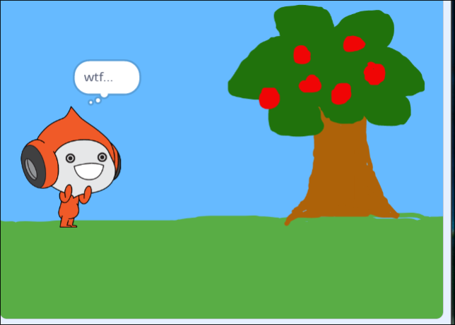
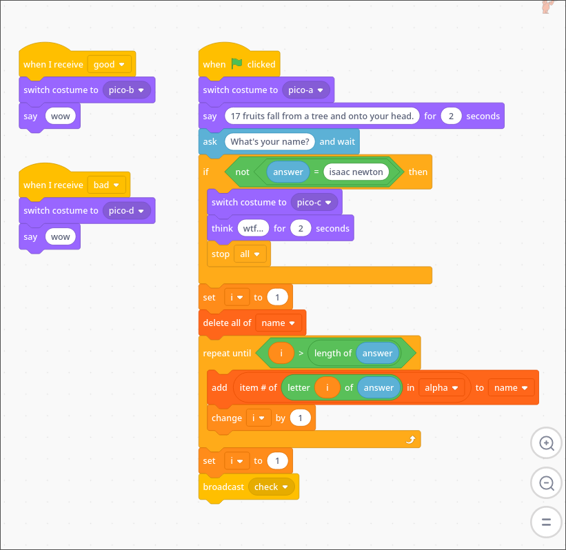
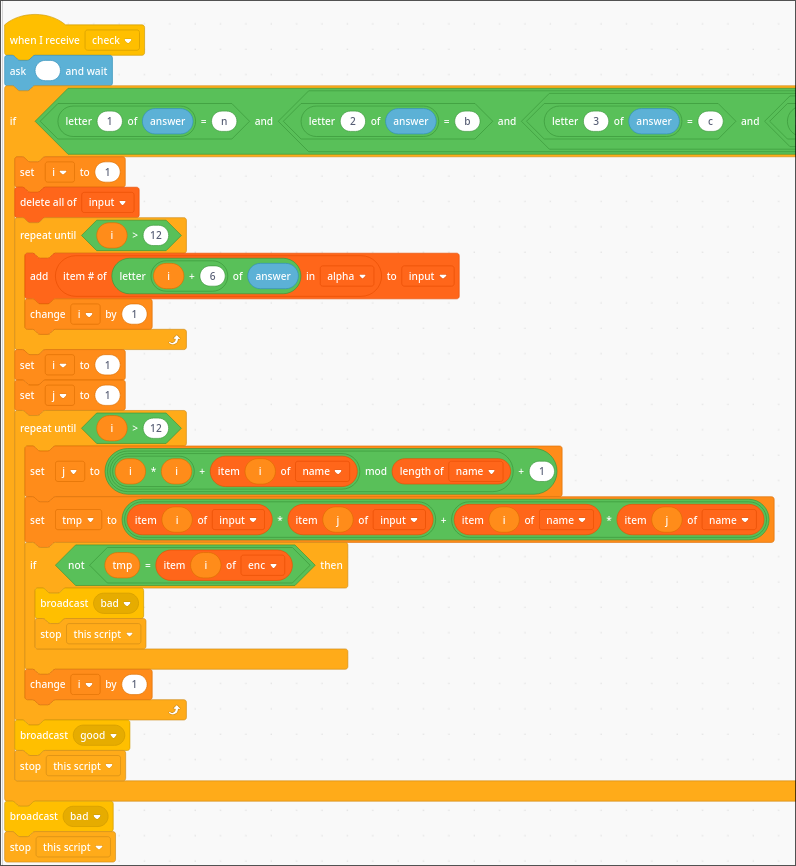

# Itchy Scratchy #

## Overview ##

464 points

Category: [rev](../)

Tags: `nbctf 2023` `rev`

## Description ##

Yeah sorry, I couldn't resist. Use Turbowarp if you want.

Downloads:

[itchyscratchy.sb3](https://nbctf.com/uploads?key=87e7c94d576e790e9073e720d1ad7af2680a4c2446f9c9866ad1052640281b39%2Fitchyscratchy.sb3)

## Solution ##

The sb3 file contains a bunch of unreadable gibberish so as the description suggests, we can place the file into turbowarp, which will
interpret the contents of the file.

When running the program, we are greeted by some guy standing by an apple tree, who tells us that "17 fruits fall from a tree and onto your
head" before asking for our name.

Replying will usually result in this guy replying with "wtf..."



Now we can look at the code inside of the program. It seems that we must tell the guy our name is 'isaac newton' before moving on. This name is stored
in the sensing variable named `answer`.



We can also see the following variables in the variables section:

`alpha`: `zvtwrca57n49u2by1jdqo6g0ksxfi8pelmh3`
`enc`: `902 764 141 454 207 51 532 1013 496 181 562 342`
`input`: changes
`name`: changes


The code gets rid of what was originally in `name` and initializes it by iterating through every character of `answer`, finding the index of that
character in `alpha`, and appending it to the now empty `name`. However, `answer` = 'isaac newton' contains a space, which is not located in
`alpha`. In this case, the [scratch wiki entry for the item # of block](https://en.scratch-wiki.info/wiki/Item_Number_of_()_in_()_(block))_ states that 
"If the item is not in a list, it reports 0", meaning that the space will result in a zero getting appended to `name`

This means `name` will end up looking like `[29, 26, 7, 7, 6, 0, 10, 32, 4, 3, 21, 10]`

Afterwards, the code broadcasts to the `check` event, which is nowhere to be found. However, searching for the event in turbowarp helps us find this 
event in the code.



There is a long block of the code at the start that isn't fully captured, it is ensuring the answer contains the wrapper nbctf{contents}


The `check` event takes the real flag and translates the contents inside of the wrapper in the same way that it translated `isaac newton` for the
`name` variable. It moves this translated input into the `input` variable. To check the final result it basically does the following routine 
I've written in python:

```python
def bad():
    print("wow")

name = [29, 26, 7, 7, 6, 0, 10, 32, 4, 3, 21, 10]
enc = [902, 764, 141, 454, 207, 51, 532, 1013, 496, 181, 562, 342]

#changes depending on actual flag
input = [0, 1, 2, 3, 4, 5, 6, 7, 8, 9, 11] 

alpha = 'zvtwrca57n49u2by1jdqo6g0ksxfi8pelmh3'

i = 1
while i <= 12:
    j = ((i * i + name[i - 1]) % len(name)) + 1
    known = name[i-1] * name[j-1]

    tmp = inp[i - 1] * inp[j - 1] + known
    if tmp != enc[i - 1]:
        bad()
        break
    i += 1

```

Since we know the values of `j` and thus `name[i-1] * name[j-1]` for all values of `i`, all we need to find is the input satisfying
`inp[i-1] * inp[j-1] = enc[i-1] - known` for all `i` and `j`. We can print this out so we can better know what we're looking for

```python

...
i = 1
while i <= 12:
    j = ((i * i + name[i - 1]) % len(name)) + 1
    #print(j)
    known = name[i-1] * name[j-1]
    print((i-1, j-1))
    print(enc[i-1] - known)
    print("====")
    tmp = inp[i - 1] * inp[j - 1] + known
    i += 1
...

```

Which outputs 

```
(0, 6)
612
====
(1, 6)
504
====
(2, 4)
99
...
```

Which indicates that `input[0] * input[6] = 612`, `input[1] * input[6]` = 504, etc. Where `input` is the stuff inside the `nbctf{}`
wrapper after it was translated using `alpha`. We can quickly solve for this as we know that all values in `input` must be an integer between
1 and 36 (`alpha` has 36 members) and that some members of `input` multiply with others multiple times, allowing us to take the greatest common
denominator of some products to narrow values down. Eventually this results in the following value for `input`

`[17, 14, 33, 32, 3, 3, 36, 5, 28, 17, 11, 12]`

Which we can substitute back into letters using `alpha` as follows:

```python
alpha = 'zvtwrca57n49u2by1jdqo6g0ksxfi8pelmh3'
solution = [17, 14, 33, 32, 3, 3, 36, 5, 28, 17, 11, 12]
flag = ""
for c in solution:
    flag += alpha[c-1]
print(flag)
```

Adding the wrapper we get the flag

`nbctf{12lett3rf149}`


