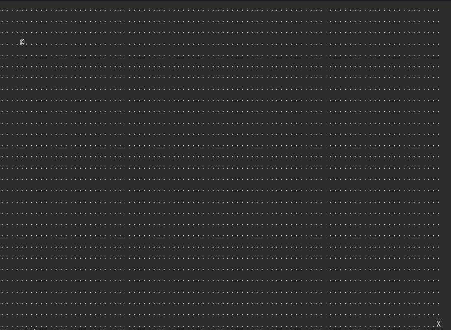
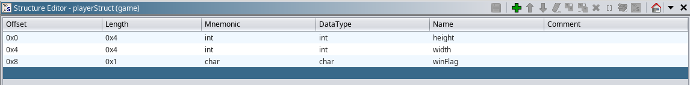
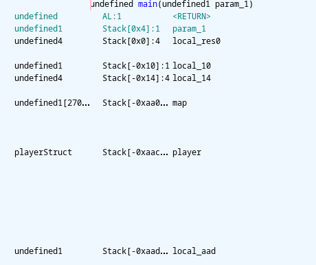

PicoCTF Babygame0: Writeup
<br>
Starting the game we see that our player starts in a 30 x 90 grid of dots. 

<br>
The objective of the game seems to be to get to the flag which is the X on the bottom right. We can use 'wasd' to control our character to move towards the X, but upon reaching it, we do not get a flag.

<br>
Using Ghidra we get the following decompiler output
<br>
```c
/* WARNING: Function: __x86.get_pc_thunk.bx replaced with injection: get_pc_thunk_bx */
/* WARNING: Globals starting with '_' overlap smaller symbols at the same address */

undefined4 main(void)

{
  int iVar1;
  undefined4 uVar2;
  int in_GS_OFFSET;
  int local_aac;
  int local_aa8;
  char local_aa4;
  undefined local_aa0 [2700];
  int local_14;
  undefined *local_10;
  
  local_10 = &stack0x00000004;
  local_14 = *(int *)(in_GS_OFFSET + 0x14);
  init_player(&local_aac);
  init_map(local_aa0,&local_aac);
  print_map(local_aa0,&local_aac);
  signal(2,sigint_handler);
  do {
    do {
      iVar1 = getchar();
      move_player(&local_aac,(int)(char)iVar1,local_aa0);
      print_map(local_aa0,&local_aac);
    } while (local_aac != 0x1d);
  } while (local_aa8 != 0x59);
  puts("You win!");
  if (local_aa4 != '\0') {
    puts("flage");
    win();
    fflush(_stdout);
  }
  uVar2 = 0;
  if (local_14 != *(int *)(in_GS_OFFSET + 0x14)) {
    uVar2 = __stack_chk_fail_local();
  }
  return uVar2;
}
```
<br>
**local_aa0** should be the map because the map has 30 x 90 = 2700 tiles. It is also passed to the map initialization function.
We know the flag has coordinates 0x1d and 0x59 so from where the game checks for a win, we can see that **local_aac** and **local_aa8**  corresponds to the height and width of the player. Furthermore, the function init_player  shows that these are both initiated to 4. From init_player we can also see that a third variable is modified, this variable should be **local_aa4**. Near the end of main this value is checked against zero, if it is not zero, the win function is called, which will print out our flag. Because this variable is initiated to zero, we must find a way to change this value. 
```c
/* WARNING: Function: __x86.get_pc_thunk.ax replaced with injection: get_pc_thunk_ax */

void init_player(undefined4 *param_1)

{
  *param_1 = 4;
  param_1[1] = 4;
  *(undefined *)(param_1 + 2) = 0;
  return;
}
```
<br>
Now to rename some variables in the decompiler output and bundle the player data into a struct so we can more easily see what's happening. Note that all the fields in the struct are aligned to 4 bytes.
<br>

After cleaning up main:
```c
/* WARNING: Function: __x86.get_pc_thunk.bx replaced with injection: get_pc_thunk_bx */
/* WARNING: Globals starting with '_' overlap smaller symbols at the same address */

undefined4 main(void)

{
  int iVar1;
  undefined4 uVar2;
  int in_GS_OFFSET;
  playerStruct player;
  undefined map [2700];
  int local_14;
  undefined *local_10;
  
  local_10 = &stack0x00000004;
  local_14 = *(int *)(in_GS_OFFSET + 0x14);
  init_player(&player);
  init_map(map,&player);
  print_map(map,&player);
  signal(2,sigint_handler);
  do {
    do {
      iVar1 = getchar();
      move_player(&player,(char)iVar1,map);
      print_map(map,&player);
    } while (player.height != 0x1d);
  } while (player.width != 0x59);
  puts("You win!");
  if (player.winFlag != '\0') {
    puts("flage");
    win();
    fflush(_stdout);
  }
  uVar2 = 0;
  if (local_14 != *(int *)(in_GS_OFFSET + 0x14)) {
    uVar2 = __stack_chk_fail_local();
  }
  return uVar2;
}
```
<br>
We see that we must first change winFlag before getting to the end of the map, our input is sent to the move_player function so it seems most promising to examine that.
```c
/* WARNING: Function: __x86.get_pc_thunk.bx replaced with injection: get_pc_thunk_bx */

void move_player(playerStruct *player,char move,int map)

{
  int iVar1;
  
  if (move == 'l') {
    iVar1 = getchar();
    player_tile = (undefined)iVar1;
  }
  if (move == 'p') {
    solve_round(map,player);
  }
  *(undefined *)(player->height * 0x5a + map + player->width) = 0x2e;
  if (move == 'w') {
    player->height = player->height + -1;
  }
  else if (move == 's') {
    player->height = player->height + 1;
  }
  else if (move == 'a') {
    player->width = player->width + -1;
  }
  else if (move == 'd') {
    player->width = player->width + 1;
  }
  *(undefined *)(player->height * 0x5a + map + player->width) = player_tile;
  return;
}
```
<br>
The game starts by writing to the position the player is at with the value 0x23, or a dot ".". It then updates the position of the player based on the key pressed, there are also some special moves that can change the character the player is displayed as or move the player to the 'X'. Finally, the game writes player_tile to the area of the map which the player's new position. Because the game does not check if the player is moving out of bounds, we can get the game to write to areas outside of the map array. This means we can use this flaw to change the value of the win flag! The only thing we need to figure out now is the location of the winflag in memory relative to the beginning of the map.
<br>

<br>
The base memory address of map is 0xaac - 0xaa0 = 0xc bytes above the base memory address of player, so in order to access the first field of player we would access map[-12]  (map is an array of type undefined which has length one byte), however we want to access the last field of player, which is 0x8 bytes above the base address, or map[8-12] = map[-4]. move_player updates the map by multiplying player height by 0x5a and adding that to player width, so one way we can easily access map[-4] is by moving to the top left corner, which will set player height and width to zero, and moving left 4 times. This will move the player onto the win flag, causing the move_player to overwrite it to a nonzero value. You can then press 'p' to instantly solve and print out the flag. Trying this on a challenge instance results in the flag picoCTF{gamer_m0d3_enabled_fff873ca}
<br>

