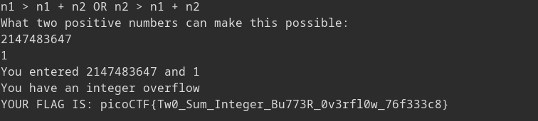

picoCTF two-sum writeup: 
The way to solve this challenge is by providing either two positive integers that have
a negative sum, or two negative integers that have a positive sum. What??? How can this
be possible? Well it turns out that this is possible because of how signed integers
are represented. When looking at a number in twos complement, we can tell it is negative
if its most significant bit is a 1, otherwise it is positive. If it is negative, we can
get its value by subtracting the MSB from the rest of the number. 
For example, using four bit numbers:  
`0b1101 = 0b0101 - 0b1000 = 5 - 8 = -3`

If the number is positive, we don't need to do anything to it.
This format ensures that adding negative numbers with positive numbers
gives a correct result, but adding positive and positive or negative and
negative can fail if the number is too big. For example, using four bit numbers to evaluate `7 + 1` we get
`0b0111 + 0b0001 = 0b1000 = -8`
We should get 8, but we actually get -8 because we can only represent the positive numbers 
`0b000` through `0b111` (7) using this system, as the last bit is reserved for sign. We can abuse
this to solve our challenge. Because the challenge uses 32 bit integers, `0x7fffffff` (`0b01111...`) = `2147483647`
is the biggest positive number we can store, adding any other valid positive number like `1` will cause
the number to be represented as negative. 
Trying this on a challenge instance:

We get the flag **picoCTF{Tw0_Sum_Integer_Bu773R_0v3rfl0w_76f333c8}**
