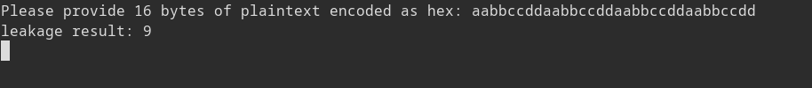

# PowerAnalysis: Warmup #

## Overview ##

200 points

Category: [Crypto](../../)

Tags: `picoCTF 2023` `Cryptography`

## Description ##

This encryption algorithm leaks a "bit" of data every time it does a computation. Use this to figure out the encryption key. Download the encryption program here [encrypt.py](https://artifacts.picoctf.net/c/427/encrypt.py). Access the running server with nc saturn.picoctf.net PORT. The flag will be of the format picoCTF{\<encryption key\>} where \<encryption key\> is 32 lowercase hex characters comprising the 16-byte encryption key being used by the program.

## Solution ##

We will use a simple form of correlation power analysis for this attack, for more details on correlation power analysis, check out the write ups for the [other](../rest) challenges in this series.

When we access the running server, we are prompted to enter 16 bytes of data in hex. The result is a some leakage.



Looking at the code we are provided, it seems that the leak is the sum of the LSB's of each plain text byte after it has been xor-red against a key byte (now referred to as a sub key) and replaced with a look up into the s-box. 

```
# Leaks one bit of information every operation
leak_buf = []
def leaky_aes_secret(data_byte, key_byte):
    out = Sbox[data_byte ^ key_byte]
    leak_buf.append(out & 0x01)
    return out

# Simplified version of AES with only a single encryption stage
def encrypt(plaintext, key):
    global leak_buf
    leak_buf = []
    ciphertext = [leaky_aes_secret(plaintext[i], key[i]) for i in range(16)]
    return ciphertext

# Leak the number of 1 bits in the lowest bit of every SBox output
def encrypt_and_leak(plaintext):
    ciphertext = encrypt(plaintext, SECRET_KEY)
    ciphertext = None # throw away result
    time.sleep(0.01)
    return leak_buf.count(1)
```

We will find this key sub-key by sub-key, meaning we will find one byte of the key at a time. We do this by calculating the leakage that sub key will contribute (it will either be zero or one bits) for each plain text and comparing it against the leakage results. If the leakage calculated from the guessed sub-key rises when the actual leakage rises and falls when the actual leakage falls, it is more likely to be the actual sub-key. We can do this for all 16 sub-keys (AES-128 uses 16 byte keys). We can look for similar behavior between the guessed key's leakages and actual leakages by finding the correlation coefficient between the guessed leakages and actual leakages. The sub-key with the highest correlation should be the correct one.

The code that does this is in [correlate.py](./correlate.py)

```picoCTF{81808c36fca7288b8a57f90907ccbae6}```
