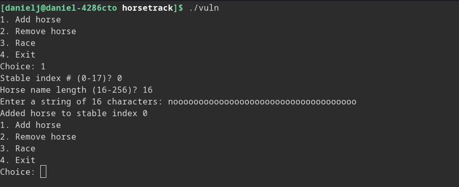
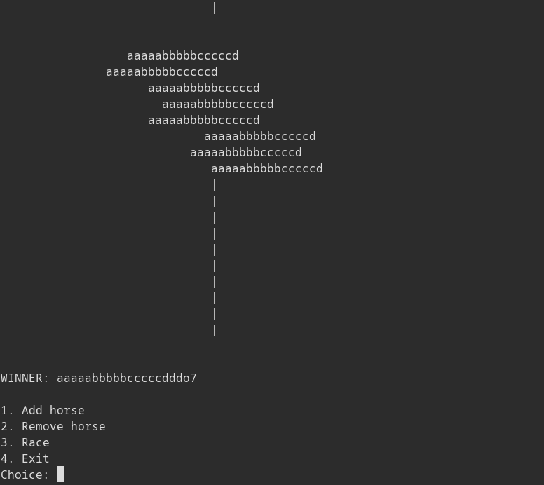

picoCTF2023 Horsetrack writeup:
From the challenge description this is heap exploitation? 
This will be my first heap exploitation challenge, sounds fun!

Had to have libc shared object and ld or won't run? Bash just says missing, 
otherwise also need to chmod +x them too or permission denied


I'm stupid and realize its asking for name length, not name


Going over character limit does not break game???


Anyways it took forever to add horses so I made this crappy script

```python
def addHorse(stable, length = 16, name = "hinohinohinohino"):
	print(f"1\n{stable}\n{length}\n{name}")

def dumbAddHorse(stable):
	length = 16
	name = "hihohihohihohi"
	if (stable < 10):
		name += "h"
	print(f"1\n{stable}\n{length}\n{name}{stable}")
	

for i in range(8):
	dumbAddHorse(i)
```

Then I ran `(python automate.py && cat) | ./vuln` before racing

The horses all line up to race and go towards the finish line


Long names get trunctuated to 16 chars it looks like


Exploring trunc more, it looks like it takes the first 16 characters to display when racing


More crappy python code used
```python
def addHorse(stable, length = 16, name = "hinohinohinohino"):
	print(f"1\n{stable}\n{length}\n{name}")

def dumbAddHorse(stable):
	length = 20
	name = "aaaaabbbbbcccccddd"
	if (stable < 10):
		name += "o"
	print(f"1\n{stable}\n{length}\n{name}{stable}")
	

for i in range(8):
	dumbAddHorse(i)
```

Ok how boring thats all cool and stuff but lets open it up in ghidra and see how it looks eh?
Wtf where did all the symbols go (it is stripped file D:)


Can still use entry to find main :D

Funny decompiler output!
Wait a minute stuff being set up before we even get to horse selection prompt?!?!
0x120 bytes malloc()ed to **local_18**, which is then passed to FUN_0040130f, FUN_00401b4d
called without arguments before as another init to main?

**local_20** is checked against zero before the prompt screen appears and you are sent to goodbye
if it is zero, it is init to zero so one of the 4 options must change its value, perhaps it is
return value?

**local_24** is probs user input

Lets look at FUN_00401b4d (stuff before 0x120 byte pointer array passed to other func)
OHHHH
so it sets stdin and stdout and stderr to be unbuffered, which is why the original idea of just doing
python automate.py | ./vuln doesn't work, as there is the assumption that stdin is line buffered, otherwise
it just eats up every character one by one!

Ok **local_1c** is 4 byte integer (or maybe 8 byte that only reads 4 bytes?) that gets 4 bytes of data
from /dev/urandom, this value isn't returned so I have no clue why it does this. WAIT I UNDERSTNAD EVERYHTING

Ok so srand(x) does not make x a random number it sets x as the seed for random number gen rand(), **local_1c**
is passed as argument to srand() so what this function also does is get a random value from /dev/urandom and set it
as seed for pseudo random generator, maybe this is something we want to exploit? Explains why nothing is returned, this
function just sets all input/output to unbuffered and gets random seed.

Ok now to explore that weird **FUN_0040130f** that takes in the big buffer as input
Next daaaaay
Looking structure editor turns out int is 32 bit not 64 bit even if program is 64 bit
Init 0x120 byte array function divides array into 0x12 segments with 0x10 bytes looks like

`0x00 0x00 0x00 0x00 0x00 0x00 0x00 0x00 |valc 0x00 0x00 0x00| 0x00 0x00 0x00 0x00`

Now to look at ghidra broken switch analysis
There is very confusing switch that involves the value 0x402288

First it takes user input (1-4) and multiplies by four and adds to 0x402288, this means 0x402288 is a table,
it is an array with 4 undefined four byte numbers. They are probably addresses, wait they are four bytes they
can't be addresses. lets look at this array and see what values there are:

`0xfffffa65 0xfffffa80 0xfffffaa0 0xfffffac0` 

hmmm, if they are signed we have

`-0x59b -0x580 -0x560 -0x540` Why does -0x59b not 0x20 above others???

Wait first choice is 1 therefore actually array needs an extra because we start indexing at table[1] to table[4]
add `0xfffffb7a` or `-0x486`? what

Calculating the addresses our numbers jump to are (from 1 to 4):

`0x401d08 0x401d28 0x401d48 0x401e02` and zero option is 0x401ced

After looking at the table I realized I had not tried 0 as an input yet and so, trying lead to interesting results

Ok I fixed the weird issue by defining 0x401d08-0x401d27 as a function and it fixes weird warning? wtf?


I FIXED THE SWITCH PROBLEM!!!
There is a script in script manager window called switchOverride that you can run after selecting the initial jump and
all the possible addresses that the switch will jump to, it looks way janky now but I think it works!

Now looking at case 1 add horse:
It returns uVar2 which is set to zero when you give it an incorrect input, which main then uses to
kick you out of the game

Looks like 0x120 byte heap data is actually a table of 0x12 structs of size 0x10 that contains in order: 
```c
char* name;
int stableIndex; //actually this should be horsePosition
int nameLength;;
```

Here is image of horses after being init on heap


Hmmmmmm setHorse() function looks vulnerable because it just writes whatever to memory
address pointed to by the name buffer, perhaps can overflow name buffer to point to have
it point to some return value and pop shell?

In race there is function I name checkForEnd that lookas at one of the numbers set in initheap
and sees if one is above 0x1d so I think its not actually stableIndex but position of horse

Function called later adds a number between 0-4 to horse position for every horse


Looking at gdb I look at heap to see what happens when add hors

Usefule info???

```
Redefine command "hook-stop"? (y or n) y
Type commands for definition of "hook-stop".
End with a line saying just "end".
>x/80wx 0x405290
>x/40wx 0x004055b0 - 0x10
>end
(gdb) info breakpoints 
Num     Type           Disp Enb Address            What
1       breakpoint     keep y   0x0000000000401c65 
	breakpoint already hit 2 times
(gdb) 
```

Oppsie daisy looks like I forgot to look at remove horse function silly me :P
It turns out it frees the name pointer associated with the horse, but it does not get rid
of the pointer, so it is still in memory. This pointer can be accessed by headStart() because
it does not check if use bit is set before writing to address (hence why headStart on non-initialized
horse causes segfault because it is trying to write to NULL) Use after freee????

Doing some heap work I was going to give up until I looked a bit at a video by sloppyJoePirates and an azeria-labs
guide on heap exploitation. I still don't know if I'll be able to solve this but I do wanna explore a bit more.

Video points out as I failed to realize that writing \0xff to setHorseName or whatever function it is stops it from
reading anymore because it stops writing when char is -1 (255 = 0xff) for some weird reason. Basically you can make
horse which allocates a chunk, don't write anything to name, free horse, and make a new horse which will put it on the
same freed chunk. User data will have forward and backward pointers as long as you don't write anything when the game
asks for horse name (0xff) so when you race the game will leak these pointers.

Using GEF 


From other writeups I learned that the fd pointers for heap chunks use something called safe linking which just means
that the fd pointer is mangled up a bit. What happens is you take the address of the fd pointer, shift it the the right
by 12 bits (you lose data), and xor it with the fd pointer. This makes it harder to do stuff even after leaking data because
you don't know where the fd pointer is pointing without the address of the fd pointer. However, this also means that theres
a way to leak the address of one special fd pointer, specifically tcache end of linked list. This pointer will be NULL, so
what happens is address >> 12 is xored with zero so the value stored here (which we can read) is just the address shifted
right by 12, precisely the value we need to forge a valid fd! Therefore if we can get target tcache chunk to be last at
linked list (this is done by having it added to tcache bin first), we can "sign" valid file pointers and pwn!!! I think you
can also use this to get address of code to pwn

Operation so far:
Allocate horses x12 (0-11)
HHHHHHHHHHHH
Free horses starting from end remove horses (11-0)
HHHHHHHHHHH<
HHHHHHHHHH<
HHHHHHHHH<
HHHHHHHH<
HHHHHHH<
HHHHHH<
HHHHH<
These go into tcache bin rest end up becoming unsorted
UUUUU		(unsorted chunks)
TTTTTT**T**		(tcache bold one should leak because it was free()ed first)

So basically horse 11 should have cheat go into it?

I've written some code that gets leaked addresses here is output

As you can see, 12 horses were initialized, but only 8 values were returned, this is because some of the horses were in
the large unsorted chunk, and some of the data areas are set to zero. The code ignores zeros, so this is all that is output.
Code looks like this

```python
def getPointers():
	p.sendlineafter("Choice: ", b"3")
	data = b""
	x = p.recvline()
	data += x
	while (not (b"WINNER" in x)):
		x = p.recvline()
		data += x
		if (b"\n\n" in data):
			print("done recieving data!")
			break
	somePointers = data.split(b"|")
	leakedPointers = []
	
	print(data)
	for pointer in somePointers:
		pointer = pointer.strip(b" \n")
		pointer = pointer.ljust(8, b"\x00")
		pointer = pwn.u64(pointer)
		if (pointer != 0):
			leakedPointers.append(pointer)
			print(hex(pointer))
	
	print(leakedPointers)
```

Sorry for very messy
From the output, everything below the large value containing 0x7fcaa4357040 is part of what was unsorted bin
Of course horse containing this addr should be 8th horse allocated (because it gets allocated after all the
tcache bins are allocated, so this is the orse in stable 7) Likewise horse containing forgable value is horse
6 because it goes into the tcache bin that was last freed.

Wait heap addresses are very large and what we get are heap shifted right 12 bits so almost all other pointers should
be heap shifted right 12 bits too so that means we can use the value thats leaked to decode addresses of all fd pointers
that are leaked!!! (and sign too)

Ok what??? So there are two values that get leaked that are one off to each other, one can be used to sign/decode tcache addresses
but the heap base address is different so it doesn't work for unsorted which means no libc :( but everytime I check gdb the key
for unsorted is alyways the latter of the two values thats one off, and its from a chunk in the middle of unsorted. Whaaat?
What does this mean

Ok it turns out pointer mangling happens on Tcache chunks but they do not happen on unsorted chunks so those are free to
exploit, I was trying to unmangle unsorted chunk FD pointers the entire time when that wasn't neccessary, which resulted in
wrong guesses for libc base. When I realized this, I started getting being able to correctly find libc base addr based on 
these leaks, now can do tcache poison and pwn!!!

First find address to override in GOT. We can choose any function that will be called later, we can change this function address
to that of libc sys and pass it a pointer to a string "/bin/sh", if we use free we can do just that, so lets overwrite free
to sys call and name a horse "/bin/sh" to pass it to.


Free is at 0x404018 but we need to align addresses by 0x10 so we need to alloc 8 bits below free at 0x404010. What we can do
is free two horses which will place two chunks into tcache bin. Bin -> T1 -> T2, We can modify T1 next pointer, normally
it will point to T2, but we can set it to point to 0x404010 (also note that value at 0x404010 is 0x0000000000000000 so it will
appear as end of chain). Afterwards we can allocate a chunk of same size as bin size which will allocate a bin at where
T1 points, giving us the ability to write to 0x404010. 


```c
/* WARNING: Switch with 1 destination removed at 0x00401cea */
/* WARNING: Exceeded maximum restarts with more pending */

undefined8 main(void)

{
  long in_FS_OFFSET;
  uint local_24;
  int local_20;
  void *local_18;
  long local_10;
  
  local_10 = *(long *)(in_FS_OFFSET + 0x28);
  local_18 = malloc(0x120);
  local_24 = 0;
  local_20 = 0;
  FUN_00401b4d();
  FUN_0040130f(local_18);
  while (local_20 == 0) {
    puts("1. Add horse");
    puts("2. Remove horse");
    puts("3. Race");
    puts("4. Exit");
    printf("Choice: ");
    __isoc99_scanf(&DAT_0040204b,&local_24);
    if (local_24 < 5) {
                    /* WARNING: Could not find normalized switch variable to match jumptable */
                    /* WARNING: This code block may not be properly labeled as switch case */
      FUN_00401a39(local_18);
      uRam00000000004040ec = 1;
    }
    else {
      puts("Invalid choice");
    }
  }
  puts("Goodbye!");
  if (local_10 == *(long *)(in_FS_OFFSET + 0x28)) {
    return 0;
  }
                    /* WARNING: Subroutine does not return */
  __stack_chk_fail();
}
```

```c
void FUN_00401b4d(void)

{
  long in_FS_OFFSET;
  uint local_1c;
  FILE *local_18;
  long local_10;
  
  local_10 = *(long *)(in_FS_OFFSET + 0x28);
  setbuf(stdin,(char *)0x0);
  setbuf(stdout,(char *)0x0);
  setbuf(stderr,(char *)0x0);
  local_18 = fopen("/dev/urandom","r");
  local_1c = 0;
  fread(&local_1c,4,1,local_18);
  fclose(local_18);
  srand(local_1c);
  if (local_10 != *(long *)(in_FS_OFFSET + 0x28)) {
                    /* WARNING: Subroutine does not return */
    __stack_chk_fail();
  }
  return;
}
```


