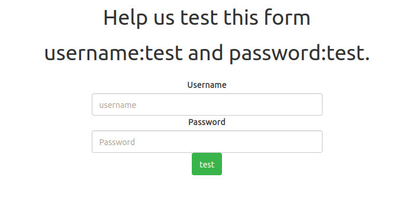
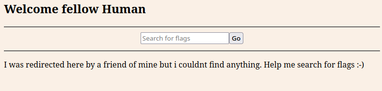
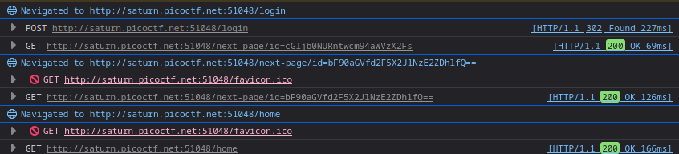

# Findme #

## Overview ##

100 points

Category: [web](../)

Tags: `#picoCTF 2023` `Web Exploitation`

## Description ##

Help us test the form by submiting the username as `test` and password as `test`!

Additional details will be available after launching your challenge instance.

## Solution ##

The challenge contains a form which you can enter login credentials to.
 

 
We are told to use username `test` and password `test!`
After entering the username and password:
 

 
There is a text box that lets us "Search for flags" but it doesn't do much, instead we look for redirects as the hint tells us to at start.
 

 
After turning on persist logs in firefox dev tools network tab, we can see we get redirected to two other pages after we log in:

`.../next-page/id=cGljb0NURntwcm94aWVzX2Fs`

 and 
 
 `.../next-page/id=bF90aGVfd2F5X2JlNzE2ZDhlfQ==`
 
These are base64 encoded values, the first decodes to `picoCTF{proxies_al' while the second `l_the_way_be716d8e}`, the flag is therefore picoCTF{proxies_all_the_way_be716d8e}
