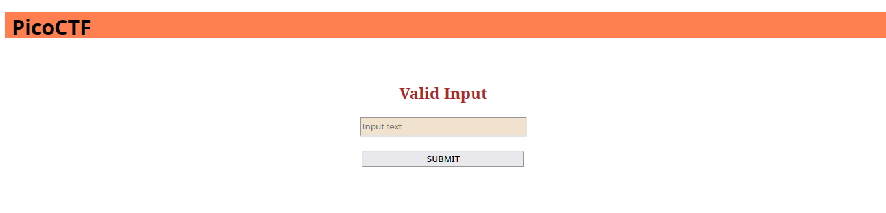

# MatchTheRegex #

## Overview ##

100 points

Category: [web](../)

Tags: `#picoCTF 2023` `Web Exploitation`

## Description ##

How about trying to match a regular expression

Additional details will be available after launching your challenge instance.

## Solution ##

The website asks to submit input to match against something, trying something silly like `qwerty` gives the prompt
`wrong match! Try again!`. Guessing that we should match the flag, try something like `picoCTF{.*}` and we get `picoCTF{succ3ssfully_matchtheregex_9080e406}`
