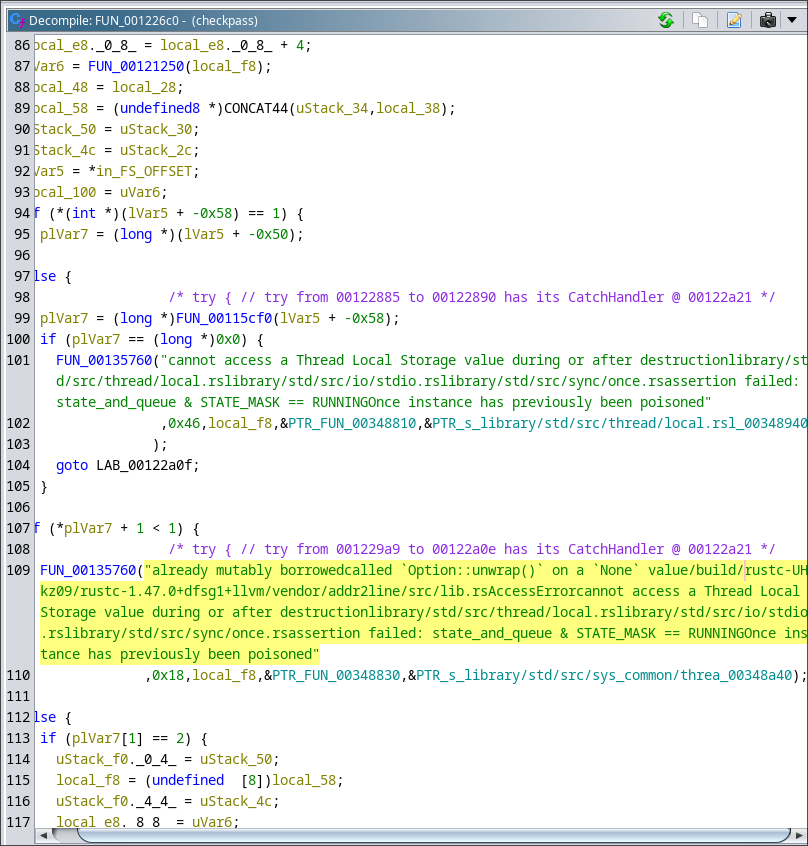

# Checkpass #

## Overview ##

375 points

Category: [picoCTF 2021](../)

Tags: `picoCTF 2021` `Reverse Engineering`

## Description ##

What is the password? File: [checkpass](https://mercury.picoctf.net/static/beef707896b55295ef881fec2ae3490b/checkpass) Flag format: <br> picoCTF{...}

## Solution ##

Haha imagine doing the intended side channel attack when you can just do rev :p

When launching the program we are told we need to pass in the flag via a command line argument, when we pass one in we're either told
the length of the flag is invalid or we gave the wrong one.

```
[danielj@daniel checkpass]$ ./checkpass
Usage:
        ./checkpass <password>
[danielj@daniel checkpass]$ ./checkpass password
Invalid length
[danielj@daniel checkpass]$ ./checkpass 12345678901234567890123456789012345678901
Invalid password
[danielj@daniel checkpass]$
```

When we open the program using Ghidra we can see its written in rust by all
the messages that some of the functions contain.



We can find the actual program by going to the entry point and finding 
main from \__libc_start_main. We see that its just a wrapper for the actual
main function, which I've named `mainMain`

```c
void main(void)
{
  code *local_8;
  
  local_8 = mainMain;
  FUN_001226c0(&local_8,0x3482a8);
  return;
}
```

The actual main looks like this:

```c
void mainMain(void)

{
  byte *pbVar1;
  undefined4 *puVar2;
  undefined4 uVar3;
  undefined4 uVar4;
  undefined4 uVar5;
  undefined4 uVar6;
  undefined4 uVar7;
  undefined4 uVar8;
  undefined4 uVar9;
  ulonglong local_128 [2];
  char scrambledArray [53];
  ulonglong *array;
  undefined4 local_b8;
  undefined4 uStack_b4;
  long lStack_b0;
  long local_a8;
  code *pcStack_a0;
  long argumentsAndStuff [2];
  long local_78;
  char local_70 [32];
  char local_50 [32];
  byte *input;
  
  FUN_0011f000(&local_a8);
  FUN_00106a00(argumentsAndStuff,local_128);
  if (local_78 == 2) {
                    /* Check if length of second argument is indeed 0x29 or 41 characters */
    if (*(long *)(argumentsAndStuff[0] + 0x28) == 0x29) {
      input = *(byte **)(argumentsAndStuff[0] + 0x18);
                    /* Check if end is } */
      if (((input == &DAT_00139d78) || (*(long *)input == 0x7b4654436f636970)) &&
         ((pbVar1 = input + 0x28, pbVar1 == &DAT_00139d94 || (*pbVar1 == 0x7d)))) {
        if ((char)input[8] < -0x40) {
          FUN_00134220(input,0x29,8,0x29,&PTR_s_src/main.rs_00348260);
        }
        else if ((char)*pbVar1 < -0x40) {
          FUN_00134220(input + 8,0x21,0,0x20,&PTR_s_src/main.rs_00348260);
        }
        else {
                    /* I think this is a malloc */
          array = (ulonglong *)thunk_FUN_0011ac90(0x20,1);
          if (array == (ulonglong *)0x0) {
            FUN_00132f80(0x20,1);
            do {
              invalidInstructionException();
            } while( true );
          }
          local_b8 = 0x20;
          uStack_b4 = 0;
          lStack_b0 = 0;
                    /* try { // try from 00105b2a to 00105b3a has its CatchHandler @ 001065c8 */
          FUN_00106720(&array,0,0x20);
          uVar3 = *(undefined4 *)(input + 8);
          uVar4 = *(undefined4 *)(input + 0xc);
          uVar5 = *(undefined4 *)(input + 0x10);
          uVar6 = *(undefined4 *)(input + 0x14);
          uVar7 = *(undefined4 *)(input + 0x1c);
          uVar8 = *(undefined4 *)(input + 0x20);
          uVar9 = *(undefined4 *)(input + 0x24);
          puVar2 = (undefined4 *)((long)array + lStack_b0 + 0x10);
          *puVar2 = *(undefined4 *)(input + 0x18);
          puVar2[1] = uVar7;
          puVar2[2] = uVar8;
          puVar2[3] = uVar9;
          puVar2 = (undefined4 *)((long)array + lStack_b0);
          *puVar2 = uVar3;
          puVar2[1] = uVar4;
          puVar2[2] = uVar5;
          puVar2[3] = uVar6;
          if (lStack_b0 == 0) {
            local_128[0] = *array;
            local_128[1] = array[1];
                    /* try { // try from 00105b77 to 001065c2 has its CatchHandler @ 001065d7 */
            lStack_b0 = lStack_b0 + 0x20;
            scramble((byte *)local_70,local_128,0);
            scramble((byte *)local_50,local_128,1);
            scramble((byte *)&local_a8,local_128,2);
            scramble((byte *)(scrambledArray + 0x15),local_128,3);
                    /* For the above scramble functions I've tried my best to make the decompilation
                       accurate, but it keeps on missing the instructions that move the value of the
                       output of scramble into local_128 
                       
                       ¯\_(ツ)_/ */
            scrambledArray[12] = scrambledArray[24];
            scrambledArray[18] = scrambledArray[25];
            scrambledArray[9] = scrambledArray[26];
            scrambledArray[20] = scrambledArray[27];
            scrambledArray[5] = scrambledArray[28];
            scrambledArray[14] = scrambledArray[29];
            scrambledArray[19] = scrambledArray[31];
            scrambledArray[7] = scrambledArray[32];
            scrambledArray[16] = scrambledArray[34];
            scrambledArray[4] = scrambledArray[36];
            scrambledArray[8] = scrambledArray[37];
            scrambledArray[15] = scrambledArray[38];
            scrambledArray[17] = scrambledArray[39];
            scrambledArray[11] = scrambledArray[41];
            scrambledArray[10] = scrambledArray[42];
            scrambledArray[6] = scrambledArray[43];
            scrambledArray[13] = scrambledArray[49];
            scrambledArray[3] = scrambledArray[51];
                    /* The contents of the scrambled input starts at index 0x15 = 21 of
                       scambledArray.
                       Indexes 21 and above doesn't get assigned to so this code is just here to
                       waste
                       time. */
            local_128[0] = 0x19;
            scrambledArray[0] = scrambledArray[23];
            scrambledArray[1] = scrambledArray[45];
            scrambledArray[2] = scrambledArray[30];
                    /* This here just checks each element of the final scrambled input against a
                       desired output. I was confused as to why they individually compared each byte
                       out of order against a value and didn't just use a for loop, but it turns out
                       the intended solution was to use a side channel attack that measured how many
                       instructions got executed. */
            if ((((((scrambledArray[46] == -0x1a) &&
                   (local_128[0] = 0, scrambledArray[21] == '\x1f')) &&
                  (local_128[0] = 0xe, scrambledArray[35] == -7)) &&
                 ((local_128[0] = 0x13, scrambledArray[40] == 't' &&
                  (local_128[0] = 0x17, scrambledArray[44] == '\"')))) &&
                ((((local_128[0] = 1, scrambledArray[22] == 'h' &&
                   ((local_128[0] = 0x1d, scrambledArray[50] == -7 &&
                    (local_128[0] = 0x1b, scrambledArray[48] == -0x39)))) &&
                  ((local_128[0] = 0x1a, scrambledArray[47] == -0x73 &&
                   (((((local_128[0] = 0xc, scrambledArray[33] == '\"' &&
                       (local_128[0] = 0x1f, scrambledArray[52] == '{')) &&
                      (local_128[0] = 6, scrambledArray[27] == ':')) &&
                     ((local_128[0] = 10, scrambledArray[31] == -0x52 &&
                      (local_128[0] = 0xf, scrambledArray[36] == 'H')))) &&
                    (local_128[0] = 0x1e, scrambledArray[51] == '1')))))) &&
                 (((((local_128[0] = 7, scrambledArray[28] == -0x35 &&
                     (local_128[0] = 0xb, scrambledArray[32] == -0x35)) &&
                    ((local_128[0] = 5, scrambledArray[26] == '\"' &&
                     (((local_128[0] = 0x16, scrambledArray[43] == 'F' &&
                       (local_128[0] = 0x10, scrambledArray[37] == '\x05')) &&
                      (local_128[0] = 0x15, scrambledArray[42] == -0x32)))))) &&
                   ((local_128[0] = 3, scrambledArray[24] == '>' &&
                    (local_128[0] = 0x14, scrambledArray[41] == -0x33)))) &&
                  (local_128[0] = 8, scrambledArray[29] == '+')))))) &&
               ((((local_128[0] = 0x1c, scrambledArray[49] == '\x12' &&
                  (local_128[0] = 0xd, scrambledArray[34] == ' ')) &&
                 ((local_128[0] = 0x11, scrambledArray[38] == '{' &&
                  (((local_128[0] = 2, scrambledArray[23] == 'P' &&
                    (local_128[0] = 9, scrambledArray[30] == -0x7d)) &&
                   (local_128[0] = 4, scrambledArray[25] == -0x48)))))) &&
                ((local_128[0] = 0x18, scrambledArray[45] == -0x31 &&
                 (local_128[0] = 0x12, scrambledArray[39] == '{')))))) {
              FUN_001066a0();
            }
            else {
              FUN_00106650();
            }
          }
          else {
            lStack_b0 = lStack_b0 + 0x20;
            FUN_00106600();
          }
        }
      }
      else {
        FUN_00106650();
      }
    }
    else {
      FUN_00106600();
    }
  }
  else if (local_78 == 0) {
                    /* try { // try from 00105a53 to 00105b16 has its CatchHandler @ 001065e6 */
    FUN_001356a0(0,0,&PTR_s_src/main.rs_00348248);
  }
  else {
    local_a8 = argumentsAndStuff[0];
    pcStack_a0 = FUN_001054c0;
    local_128[0] = (ulonglong)&PTR_DAT_00348228;
    local_128[1] = 2;
    FUN_001083b0PrintStdout(local_128);
    FUN_0011f1d0(1);
  }
  do {
    invalidInstructionException();
  }

```

What it does is first ensure the length of the input is 41 and is of the
form picoCTF{<contents>}

After that it takes the contents of the flag without the picoCTF{} wrapper
and runs it 4 times through a function `scramble`. Each time with the 
input as the output of the previous iteration of `scramble` and a
number that goes from 0 to 3.

Finally, the output of the final scramble, which is stored in `scrambledArray`

Note that `scrambledArray` is a byte array with length 53 while the output
only contains 32 bytes. The output is stored starting at an offset 0x15 or
21 from the array, and the first 21 bytes aren't used except to store 
bytes from the output into.

Finally, the bytes starting at the offset 0x15 from `scrambledArray` are
checked individually and out of order against a desired output. The reason
for this weird behavior is to make it possible to do a side channel attack
that counts instructions, but I wasn't able to realize this.

### Scramble ###

If we can figure out how to reverse scramble we would be able to get our
original password back. `scramble` looks like this when decompiled:

```c

void scramble(byte *modified,byte *input,long offset)

{
  ulong uVar1;
  byte transformed [32];
  
                    /* change is of type byte[4][256]
                       
                       4 different arrays of 256 bytes */
  transformed[0] = change[offset][*input];
  transformed[1] = change[offset][input[1]];
  transformed[2] = change[offset][input[2]];
  transformed[3] = change[offset][input[3]];
  transformed[4] = change[offset][input[4]];
  transformed[5] = change[offset][input[5]];
  transformed[6] = change[offset][input[6]];
  transformed[7] = change[offset][input[7]];
  transformed[8] = change[offset][input[8]];
  transformed[9] = change[offset][input[9]];
  transformed[10] = change[offset][input[10]];
  transformed[11] = change[offset][input[0xb]];
  transformed[12] = change[offset][input[0xc]];
  transformed[13] = change[offset][input[0xd]];
  transformed[14] = change[offset][input[0xe]];
  transformed[15] = change[offset][input[0xf]];
  transformed[16] = change[offset][input[0x10]];
  transformed[17] = change[offset][input[0x11]];
  transformed[18] = change[offset][input[0x12]];
  transformed[19] = change[offset][input[0x13]];
  transformed[20] = change[offset][input[0x14]];
  transformed[21] = change[offset][input[0x15]];
  transformed[22] = change[offset][input[0x16]];
  transformed[23] = change[offset][input[0x17]];
  transformed[24] = change[offset][input[0x18]];
  transformed[25] = change[offset][input[0x19]];
  transformed[26] = change[offset][input[0x1a]];
  transformed[27] = change[offset][input[0x1b]];
  transformed[28] = change[offset][input[0x1c]];
  transformed[29] = change[offset][input[0x1d]];
  transformed[30] = change[offset][input[0x1e]];
  transformed[31] = change[offset][input[0x1f]];
  *(undefined (*) [16])(modified + 0x10) = ZEXT816(0);
  *(undefined (*) [16])modified = ZEXT816(0);
                    /* swap table is of type ulong[4][32]
                       
                       4 arrays of 32 unsigned longs (8 bytes) */
  uVar1 = SwapTable[offset][8];
  if (uVar1 < 0x20) {
    modified[8] = transformed[uVar1];
    uVar1 = SwapTable[offset][0x19];
    if (uVar1 < 0x20) {
      modified[0x19] = transformed[uVar1];
      uVar1 = SwapTable[offset][0x1b];
      if (uVar1 < 0x20) {
        modified[0x1b] = transformed[uVar1];
        uVar1 = SwapTable[offset][0x1c];
        if (uVar1 < 0x20) {
          modified[0x1c] = transformed[uVar1];
          uVar1 = SwapTable[offset][0x11];
          if (uVar1 < 0x20) {
            modified[0x11] = transformed[uVar1];
            uVar1 = SwapTable[offset][0xe];
            if (uVar1 < 0x20) {
              modified[0xe] = transformed[uVar1];
              uVar1 = SwapTable[offset][0xc];
              if (uVar1 < 0x20) {
                modified[0xc] = transformed[uVar1];
                uVar1 = SwapTable[offset][0xf];
                if (uVar1 < 0x20) {
                  modified[0xf] = transformed[uVar1];
                  uVar1 = SwapTable[offset][2];
                  if (uVar1 < 0x20) {
                    modified[2] = transformed[uVar1];
                    uVar1 = SwapTable[offset][0x15];
                    if (uVar1 < 0x20) {
                      modified[0x15] = transformed[uVar1];
                      uVar1 = SwapTable[offset][0x10];
                      if (uVar1 < 0x20) {
                        modified[0x10] = transformed[uVar1];
                        uVar1 = SwapTable[offset][9];
                        if (uVar1 < 0x20) {
                          modified[9] = transformed[uVar1];
                          uVar1 = SwapTable[offset][0x13];
                          if (uVar1 < 0x20) {
                            modified[0x13] = transformed[uVar1];
                            uVar1 = SwapTable[offset][10];
                            if (uVar1 < 0x20) {
                              modified[10] = transformed[uVar1];
                              uVar1 = SwapTable[offset][0xd];
                              if (uVar1 < 0x20) {
                                modified[0xd] = transformed[uVar1];
                                uVar1 = SwapTable[offset][6];
                                if (uVar1 < 0x20) {
                                  modified[6] = transformed[uVar1];
                                  uVar1 = SwapTable[offset][0x16];
                                  if (uVar1 < 0x20) {
                                    modified[0x16] = transformed[uVar1];
                                    uVar1 = SwapTable[offset][0];
                                    if (uVar1 < 0x20) {
                                      *modified = transformed[uVar1];
                                      uVar1 = SwapTable[offset][0x1e];
                                      if (uVar1 < 0x20) {
                                        modified[0x1e] = transformed[uVar1];
                                        uVar1 = SwapTable[offset][1];
                                        if (uVar1 < 0x20) {
                                          modified[1] = transformed[uVar1];
                                          uVar1 = SwapTable[offset][4];
                                          if (uVar1 < 0x20) {
                                            modified[4] = transformed[uVar1];
                                            uVar1 = SwapTable[offset][0x1a];
                                            if (uVar1 < 0x20) {
                                              modified[0x1a] = transformed[uVar1];
                                              uVar1 = SwapTable[offset][0x1d];
                                              if (uVar1 < 0x20) {
                                                modified[0x1d] = transformed[uVar1];
                                                uVar1 = SwapTable[offset][3];
                                                if (uVar1 < 0x20) {
                                                  modified[3] = transformed[uVar1];
                                                  uVar1 = SwapTable[offset][0x1f];
                                                  if (uVar1 < 0x20) {
                                                    modified[0x1f] = transformed[uVar1];
                                                    uVar1 = SwapTable[offset][0x14];
                                                    if (uVar1 < 0x20) {
                                                      modified[0x14] = transformed[uVar1];
                                                      uVar1 = SwapTable[offset][0x18];
                                                      if (uVar1 < 0x20) {
                                                        modified[0x18] = transformed[uVar1];
                                                        uVar1 = SwapTable[offset][7];
                                                        if (uVar1 < 0x20) {
                                                          modified[7] = transformed[uVar1];
                                                          uVar1 = SwapTable[offset][0xb];
                                                          if (uVar1 < 0x20) {
                                                            modified[0xb] = transformed[uVar1];
                                                            uVar1 = SwapTable[offset][0x17];
                                                            if (uVar1 < 0x20) {
                                                              modified[0x17] = transformed[uVar1];
                                                              uVar1 = SwapTable[offset][5];
                                                              if (uVar1 < 0x20) {
                                                                modified[5] = transformed[uVar1];
                                                                uVar1 = SwapTable[offset][0x12];
                                                                if (uVar1 < 0x20) {
                                                                  modified[0x12] =
                                                                       transformed[uVar1];
                                                                  return;
                                                                }
                                                              }
                                                            }
                                                          }
                                                        }
                                                      }
                                                    }
                                                  }
                                                }
                                              }
                                            }
                                          }
                                        }
                                      }
                                    }
                                  }
                                }
                              }
                            }
                          }
                        }
                      }
                    }
                  }
                }
              }
            }
          }
        }
      }
    }
  }
  FUN_001356a0(uVar1,0x20,&PTR_s_src/main.rs_003481f8);
  do {
    invalidInstructionException();
  } while( true );
}

```

It takes three arguments: a pointer to the output, a pointer to the input,
and an offset that indexes into two large arrays.

What happens is every byte of the input is substituted with a different
unique byte by indexing into a substitution table and put into the
corresponding location in a temporary array. There are four
different substitution tables, the table used is the one located at
`change[offset]`. 

The bytes in the temporary array then scrambled and put into the output
array. This is done by taking the offset of each byte in the temporary
array and using that to index into a table containing new offsets. This
new offset will be where the byte is located in the output.

The table that contains the offset is located at `swapTable[offset]`

Knowing this, we can take the hexdump of `change` and `offset` and use it
to create a [solver](./solve.py)

The value of the flag is `picoCTF{t1mingS1deChann3l_NWeA525eOE4P6q}`


