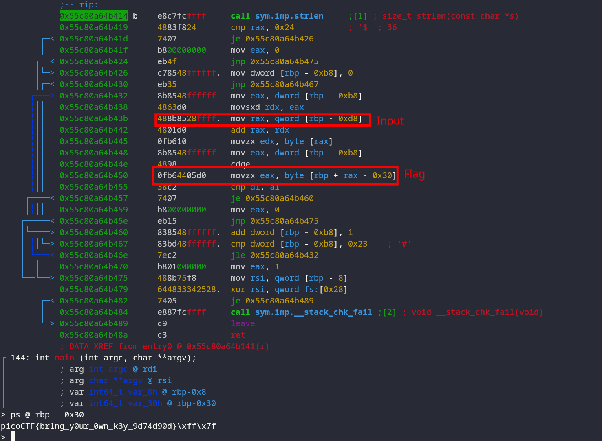

# Wizardlike #

## Overview ##

400 points

Category: [picoCTF 2022](../)

Tags: `picoCTF 2022` `Reverse Engineering` `binary` `keygen`

## Description ##

Can you get the flag?
Reverse engineer [this](https://artifacts.picoctf.net/c/53/keygenme) binary.

## Solution ##

After loading it into Ghidra, it seems the program simply checks the result of a function call with your key as the input

```
undefined8 main(void)

{
  char cVar1;
  long in_FS_OFFSET;
  char key [40];
  long local_10;
  
  local_10 = *(long *)(in_FS_OFFSET + 0x28);
  printf("Enter your license key: ");
  fgets(key,0x25,stdin);
  cVar1 = keyCheck(key);
  if (cVar1 == '\0') {
    puts("That key is invalid.");
  }
  else {
    puts("That key is valid.");
  }
  if (local_10 != *(long *)(in_FS_OFFSET + 0x28)) {
                    /* WARNING: Subroutine does not return */
    __stack_chk_fail();
  }
  return 0;
}
```

The `keyCheck` function looks really busy, messing around with a lot of variables and using MD5, however in the end all its doing is checking your key against a desired key byte by byte. 


```
...

  sVar1 = strlen(key);
  if (sVar1 == 0x24) {
    for (i = 0; i < 0x24; i = i + 1) {
      if (key[i] != finalResult[i]) {
        uVar2 = 0;
        goto LAB_00101475;
      }
    }
    uVar2 = 1;
  }
  else {
    uVar2 = 0;
  }

...

return uVar2;
```

Opening in a debugger and viewing this final string should give us the flag.



`picoCTF{br1ng_y0ur_0wn_k3y_9d74d90d}`
