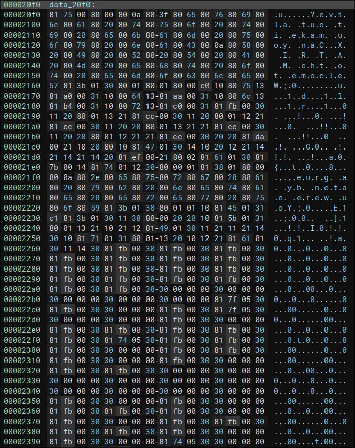
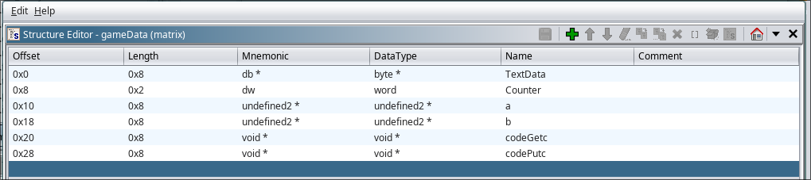
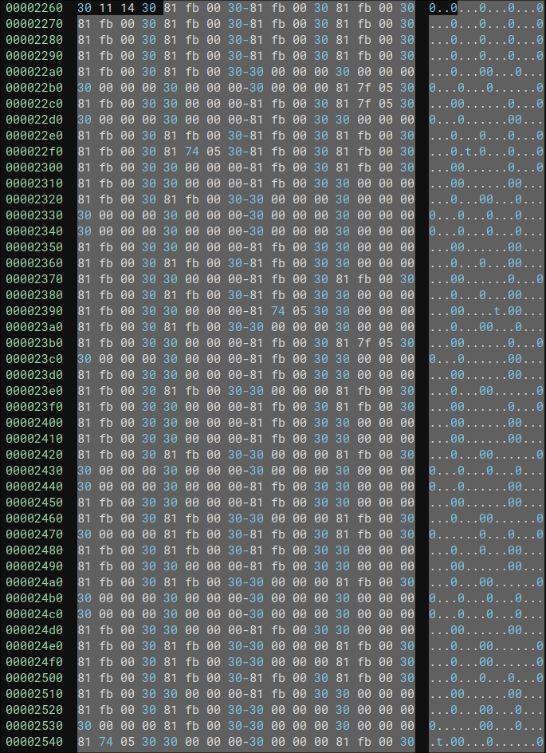

# MATRIX #

## Overview ##

500 points

Category: [picoMini by redpwn](../)

Tags: `picoMini by redpwn` `Reverse Engineering`

## Description ##

Enter the M A T R I X

```
nc mars.picoctf.net 31259
```

Download [matrix](https://artifacts.picoctf.net/picoMini+by+redpwn/Reverse+Engineering/matrix/matrix)

## Solution ##

We are given a stripped executable named `matrix`.

Upon running it prints a welcome matrix and prompts us for an input. It seems everything we do causes us to be eaten by a "grue"

```
[danielj@daniel MATRIX]$ ./matrix
Welcome to the M A T R I X
Can you make it out alive?
rrrrrr
You were eaten by a grue.
```

Next thing we can do is open the program in Ghidra.

```c

ulong main(void)
{
  char cVar1;
  undefined2 *__ptr;
  undefined2 *__ptr_00;
  ulong uVar2;
  FILE *__stream;
  long in_FS_OFFSET;
  resultStruct local_16cResult;
  gameData auStack_168GameState;
  char local_138Flag [264];
  long local_30;
  
  local_30 = *(long *)(in_FS_OFFSET + 0x28);
  setvbuf(stdout,(char *)0x0,1,0x2000);
  __ptr = (undefined2 *)malloc(0x800);
  __ptr_00 = (undefined2 *)malloc(0x800);
  auStack_168GameState.TextData = &DAT_001020f0Text;
  auStack_168GameState.Counter = 0;
  auStack_168GameState.codeGetc = FUN_00101320Getc;
  auStack_168GameState.codePutc = FUN_00101340Putc;
  auStack_168GameState.a = __ptr;
  auStack_168GameState.b = __ptr_00;
  do {
    cVar1 = FUN_00101350GameLoop(&auStack_168GameState,&local_16cResult);
  } while (cVar1 != '\0');
  free(__ptr);
  free(__ptr_00);
  if (local_16cResult.a == '\0') {
    if (local_16cResult.res == 0) {
      puts("Have a flag!");
      __stream = fopen("flag.txt","r");
      fgets(local_138Flag,0x100,__stream);
      fclose(__stream);
      puts(local_138Flag);
    }
    uVar2 = (ulong)local_16cResult.res;
  }
  else {
    uVar2 = 0xffffffff;
  }
  if (local_30 == *(long *)(in_FS_OFFSET + 0x28)) {
    return uVar2;
  }
                    /* WARNING: Subroutine does not return */
  __stack_chk_fail();
}
```

The code has been cleaned up to show that there is a struct that keeps track of the game's state. One 
interesting thing is the data stored at `DAT_001020f0Text`:



This is the view of the data in Binary Ninja, and it seems to contain the text that was printed while
playing the game like

```
Welcome to the M A T R I X
Can you make it out alive?
```

and

```
You were eaten by a grue.
```

It actually turns out that this is bytecode that gets interpreted by the program!

### Game Struct ###

The variable `auStack_168GameState` is a struct of the type I have defined below:



Its fields are as follows:

`Text Data`:

This is a pointer to a bunch of bytecode that an interpreter will run

`Counter`:

This is used to index into the bytecode to track which instruction is to be ran

`a`: 

This contains a pointer to the top of a stack, it initially points to the start of an malloc()'ed array of length 800 bytes

`b`:

This is the secondary stack pointer, it also points to the start of an array of length 800 bytes

`codeGetc`:

This field contains the pointer to a wrapper function for getc(), its
implementation looks like this:

```c
void getcWrapper(void)

{
  getc(stdin);
  return;
}
```

`codePutc`:

This field contains the pointer to a wrapper function for putc(), its
implementation looks like this:

```c
void putcWrapper(byte param_1)

{
  putc((uint)param_1,stdout);
  return;
}
```

### Interpreter ###

From the start of main we see that a function `FUN_00101350GameLoop` is called multiple times on our struct and is also given the pointer to a struct `local_16cResult` that is checked once the function returns zero.

```c
  do {
    cVar1 = FUN_00101350GameLoop(&auStack_168GameState,&local_16cResult);
  } while (cVar1 != '\0');
```

This function seems to be an interpreter of the byte code

```c
undefined8 FUN_00101350GameLoop(gameData *gameStruct,resultStruct *result)

{
  undefined uVar1;
  short sVar2;
  undefined2 uVar3;
  short *psVar4;
  undefined2 *puVar5;
  ushort *puVar6;
  ushort uVar10CounterUpdated;
  word wVar7;
  short sVar8;
  byte bVar9TextAtCounter;
  byte *pcVar6Text;
  ushort uVar3Counter;
  
  pcVar6Text = gameStruct->TextData;
  uVar3Counter = gameStruct->Counter;
  uVar10CounterUpdated = uVar3Counter + 1;
  gameStruct->Counter = uVar10CounterUpdated;
  bVar9TextAtCounter = pcVar6Text[uVar3Counter];
  switch(bVar9TextAtCounter) {
  case 0:
    break;
  case 1:
    if (result == (resultStruct *)0x0) {
      return 0;
    }
    puVar5 = gameStruct->a;
    result->a = '\0';
    uVar3Counter = puVar5[-1];
    gameStruct->a = puVar5 + -1;
    result->res = uVar3Counter;
    return 0;
  case 0x10:
    puVar5 = gameStruct->a;
    uVar3 = puVar5[-1];
    gameStruct->a = puVar5 + 1;
    *puVar5 = uVar3;
    return 1;
  case 0x11:
    gameStruct->a = gameStruct->a + -1;
    return 1;
  case 0x12:
    puVar5 = gameStruct->a;
    sVar2 = puVar5[-1];
    sVar8 = puVar5[-2];
    gameStruct->a = puVar5 + -1;
    puVar5[-2] = sVar2 + sVar8;
    return 1;
  case 0x13:
    puVar5 = gameStruct->a;
    sVar2 = puVar5[-2];
    sVar8 = puVar5[-1];
    gameStruct->a = puVar5 + -1;
    puVar5[-2] = sVar2 - sVar8;
    return 1;
  case 0x14:
    puVar5 = gameStruct->a;
    uVar3 = puVar5[-2];
    puVar5[-2] = puVar5[-1];
    gameStruct->a = puVar5;
    puVar5[-1] = uVar3;
    return 1;
  case 0x20:
    puVar5 = gameStruct->a;
    gameStruct->a = puVar5 + -1;
    uVar3 = puVar5[-1];
    puVar5 = gameStruct->b;
    gameStruct->b = puVar5 + 1;
    *puVar5 = uVar3;
    return 1;
  case 0x21:
    puVar5 = gameStruct->b;
    gameStruct->b = puVar5 + -1;
    uVar3 = puVar5[-1];
    puVar5 = gameStruct->a;
    gameStruct->a = puVar5 + 1;
    *puVar5 = uVar3;
    return 1;
  case 0x30:
    wVar7 = gameStruct->a[-1];
    gameStruct->a = gameStruct->a + -1;
    gameStruct->Counter = wVar7;
    return 1;
  case 0x31:
    puVar5 = gameStruct->a;
    sVar8 = puVar5[-2];
    wVar7 = puVar5[-1];
    gameStruct->a = puVar5 + -2;
    if (sVar8 == 0) {
LAB_0010154b:
      gameStruct->Counter = wVar7;
      return 1;
    }
    break;
  case 0x32:
    puVar5 = gameStruct->a;
    sVar8 = puVar5[-2];
    wVar7 = puVar5[-1];
    gameStruct->a = puVar5 + -2;
    if (sVar8 != 0) goto LAB_0010154b;
    break;
  case 0x33:
    puVar5 = gameStruct->a;
    sVar8 = puVar5[-2];
    wVar7 = puVar5[-1];
    gameStruct->a = puVar5 + -2;
    if (sVar8 < 0) goto LAB_0010154b;
    break;
  case 0x34:
    puVar5 = gameStruct->a;
    sVar8 = puVar5[-2];
    wVar7 = puVar5[-1];
    gameStruct->a = puVar5 + -2;
    if (sVar8 < 1) goto LAB_0010154b;
    break;
  default:
                    /* Write operation writes to buffer and increments pointer */
    if (bVar9TextAtCounter == 0xc0) {
      bVar9TextAtCounter = (*(code *)gameStruct->codeGetc)();
      puVar6 = gameStruct->a;
      gameStruct->a = puVar6 + 1;
      *puVar6 = (ushort)bVar9TextAtCounter;
      return 1;
    }
    if (bVar9TextAtCounter < 0xc1) {
      if (bVar9TextAtCounter == 0x80) {
        sVar2 = 2;
        sVar8 = (short)(char)pcVar6Text[uVar10CounterUpdated];
      }
      else {
        if (bVar9TextAtCounter != 0x81) goto switchD_0010137b_caseD_2;
        sVar2 = 3;
        sVar8 = *(short *)(pcVar6Text + uVar10CounterUpdated);
      }
      psVar4 = gameStruct->a;
      gameStruct->Counter = uVar3Counter + sVar2;
      gameStruct->a = psVar4 + 1;
      *psVar4 = sVar8;
      return 1;
    }
                    /* Read operation gets current value, prints it and decrements pointer */
    if (bVar9TextAtCounter == 0xc1) {
      uVar1 = *(undefined *)(gameStruct->a + -1);
      gameStruct->a = gameStruct->a + -1;
      (*(code *)gameStruct->codePutc)(uVar1);
      return 1;
    }
  case 2:
  case 3:
  case 4:
  case 5:
  case 6:
  case 7:
  case 8:
  case 9:
  case 10:
  case 0xb:
  case 0xc:
  case 0xd:
  case 0xe:
  case 0xf:
  case 0x15:
  case 0x16:
  case 0x17:
  case 0x18:
  case 0x19:
  case 0x1a:
  case 0x1b:
  case 0x1c:
  case 0x1d:
  case 0x1e:
  case 0x1f:
  case 0x22:
  case 0x23:
  case 0x24:
  case 0x25:
  case 0x26:
  case 0x27:
  case 0x28:
  case 0x29:
  case 0x2a:
  case 0x2b:
  case 0x2c:
  case 0x2d:
  case 0x2e:
  case 0x2f:
switchD_0010137b_caseD_2:
    if (result == (resultStruct *)0x0) {
      return 0;
    }
    result->a = '\x01';
    return 0;
  }
  return 1;
}
```

Every time it is called it updates the `counter` field of the given struct and
does something based on the value of the instruction found in that area. From
the initialization at main we know that the counter starts at zero. At this
point it seems our only option is to create an emulator/interpreter to be able
to debug and reverse engineer this program.

My program [interpreter.py](./interpreter.py) contains some information that
documents what all the instructions are doing. Afterwards came the debugger
[debugger.py](./debugger.py) which has the ability to set one break-point at
a time, print the values of registers and stack, and step and print 
instructions.

Using the debugger we can figure out what the program is doing.

`0x75`: The `a` stack is setup with the values `[x = 0x1, y = 0x1, z = 0x0]`

`0x7b` is the start of the input loop, and the program jumps to
the following areas depending on the input:

`0xa0`: Player inputs 'u', decrement `y` 

`0xaa`: Player inputs 'd', increment `y`

`0xb4`: Player inputs 'l', decrement `x`

`0xc0`: Player inputs 'r', increment `x`

`0xfb`: This prints the eaten by a grue message, you jump to this if you don't input 'u', 'd', 'l', or 'r'. It makes the interpreter return 0 and sets the values in the `result` struct to the wrong values so that the flag isn't printed.

For all of the cases except for when the player gets eaten, the program jumps to
`0xcc` after `x` and `y` are changed.

From here there is a routine that multiplies `y` by 0x10 and adds it to `x`, 
suggesting that the map has a width of 16. Afterwards this value is multiplied
by 4 and used to index into somewhere

```
(INDEX = 0x10 * y + x)

0xef-0xf7: Jump to maze which jumps back to input loop<br>
STOREW 0x7b <= This is the address of the input loop<br>

a = [x, y, z, 4 * INDEX, 0x7b]
ASWAP
a = [x, y, z, 0x7b, 4 * INDEX]
STOREW 0x174
a = [x, y, z, 0x7b, 4 * INDEX, 0x174]
ASUM
a = [x, y, z, 0x7b, 4 * INDEX + 0x174]
JUMPA  => 4 * INDEX + 0x174
a = [x, y, z, 0x7b]
```

Based off the final jump it seems every tile of the map consists of 4
instructions and the map is located at offset `0x174` from the start of
the bytecode. 

### The map ###

So now that we've figured out that we can walk around the map using 'uldr' and 
also figured out where the map is located, we just need to figure out how to win!

Looking at the map in a hex editor:



(There is also a hex dump of the entire map in [this](./maze) file)

Looking at this dump, there appears to be 5 different 4 byte sequences that we
can move to.

`0x81fb0030`: Bad

These instructions stores the word `0x00fb` onto the stack and causes us to
jump to it, `0xfb` is the routine responsible for displaying the grue message
that makes us lose.

`0x30000000`: Normal

This only contains the instruction `0x30`, the rest is padding. It causes us to
pop the value on the `a` stack and jump to it, in this case the value on top of
`a` is `0x7b`, the start of the input loop. In other words, this tile just 
causes the game to continue

`0x81740530`: Decrement `z`

These instructions make us jump to `0x0574` which is a subroutine that
decrements `z` and checks if `z` is less then zero. If it is, we die and
lose, otherwise we jump back to the input loop and continue playing.

`0x817f0530`: Increment `z`

These instructions make us jump to `0x057f` which is a subroutine that
increments `z` and returns us to the input loop to continue playing

`0x81850530`: Win

These instructions make us jump to `0x0585` which causes the interpreter to
stop and set the right values in the `result` struct so that the flag gets printed.

Knowing that the map is 16 tiles wide and what all the tiles do, we can write
a [program](./dump.py) that prints out the map by looking at the [hexdump](./dump).

```
################
#X    +# #+  # #
####-### ### # #
#          # # #
## # ##### # - #
#  # #+  # # # #
# ## ### # # # #
# #      # # # #
# # ###### # # #
# #        # # #
# ### ###### # #
#   #  -  #  # #
# ###  #  # #  #
# #   ### # #-##
# #    #  - #  #
##############~#
```

(The `X` was added in to show where the player starts)

The tiles are as follows

`#`: Bad

` `: Normal

`-`: Decrement `z`

`+`: Increment `z`

`~`: Win

Because there are `-` tiles blocking our way, we need to ensure our value of `z`
doesn't get too low. One way to do this is to just hit the `+` at the beginning
a bunch of times before moving on because they don't disappear when you hit them.

The final solution looks like this:

`rrrrrlrlrlrlrlrlrlrlrllddddddlddrrddrrrrdddrruuuruuuuuuurrddddddddlddrd`

Testing on the server:

```
[danielj@daniel MATRIX]$ cat solve | nc mars.picoctf.net 31259
Welcome to the M A T R I X
Can you make it out alive?
Congratulations, you made it!
Have a flag!
picoCTF{y0uv3_3sc4p3d_th3_m4ze...f0r_n0w-hYkq2D9PmrA5GpEq}
```
