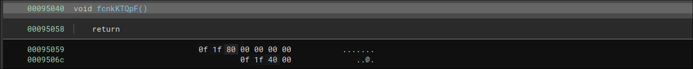
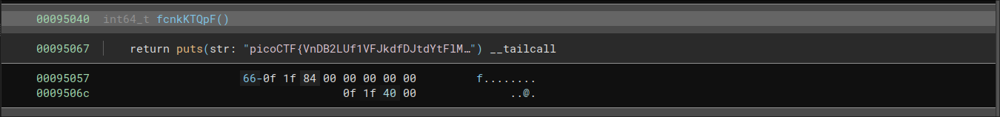

# breadth #

## Overview ##

200 points

Category: [picoMini by redpwn](../)

Tags: `picoMini by redpwn` `Reverse Engineering`

## Description ##

Surely this is what people mean when they say "horizontal scaling," right?

**TOP SECRET INFO:**

Our operatives managed to exfiltrate an in-development version of this challenge, where the function with the real flag had a mistake in it.
Can you help us get the flag?

[download breadth.v2](https://artifacts.picoctf.net/picoMini+by+redpwn/Reverse+Engineering/breadth/breadth.v2)

[download breadth.v1](https://artifacts.picoctf.net/picoMini+by+redpwn/Reverse+Engineering/breadth/breadth.v1)

## Solution ##

When running any of the binaries we've been given, we get the output

```
Dead code? What's that?
Goodbye!
```

Running strings on the two programs, we see a bunch of dummy flags and
text. If we run `diff` on the two outputs we don't get much output

```
[danielj@daniel breadth]$ strings breadth.v1 > s1
[danielj@daniel breadth]$ strings breadth.v2 > s2
[danielj@daniel breadth]$ diff s1 s2
2d1
< Pa/1
20841c20840
< generated.v1.c
---
> generated.v2.c
```

Instead, we can try running diff on the hexdumps of the files

```
[danielj@daniel breadth]$ hexdump -C breadth.v1 > v1.hex
[danielj@daniel breadth]$ hexdump -C breadth.v2 > v2.hex
[danielj@daniel breadth]$ diff v1.hex v2.hex
46,47c46,47
< 000002d0  47 4e 55 00 cd 50 61 2f  31 e8 93 68 19 73 b9 90  |GNU..Pa/1..h.s..|
< 000002e0  ff cb c7 d7 b8 a8 f1 b4  04 00 00 00 10 00 00 00  |................|
---
> 000002d0  47 4e 55 00 43 52 e5 d7  4f 75 9f f9 9c 57 06 0c  |GNU.CR..Ou...W..|
> 000002e0  2b c2 df 27 51 a7 dd a9  04 00 00 00 10 00 00 00  |+..'Q...........|
37980,37981c37980,37981
< 00095040  48 c7 44 24 f0 3e c7 1b  04 48 8b 54 24 f0 b8 3a  |H.D$.>...H.T$..:|
< 00095050  80 37 d0 48 39 c2 74 08  c3 0f 1f 80 00 00 00 00  |.7.H9.t.........|
---
> 00095040  48 c7 44 24 f0 3e c7 1b  04 48 8b 44 24 f0 48 3d  |H.D$.>...H.D$.H=|
> 00095050  3e c7 1b 04 74 0a c3 66  0f 1f 84 00 00 00 00 00  |>...t..f........|
151840c151840
< 00253750  64 2e 76 31 2e 63 00 5f  5f 46 52 41 4d 45 5f 45  |d.v1.c.__FRAME_E|
---
> 00253750  64 2e 76 32 2e 63 00 5f  5f 46 52 41 4d 45 5f 45  |d.v2.c.__FRAME_E|
```

There seems to be something interesting happening at `0x95040` so we could take a look there

Opening both programs in Binary Ninja,

v1:



v2:



We see that a flag is being printed here, the value of this flag is

`picoCTF{VnDB2LUf1VFJkdfDJtdYtFlMexPxXS6X}`
